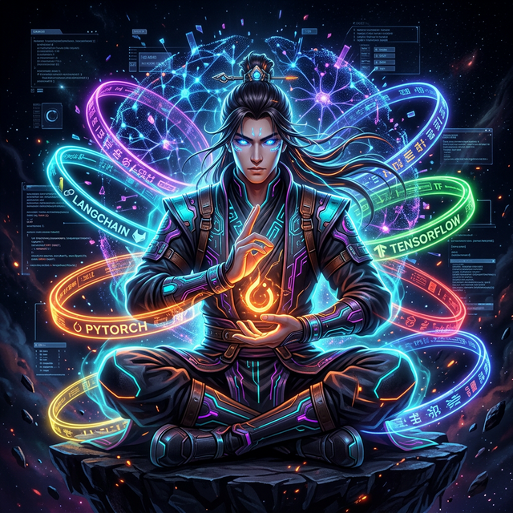
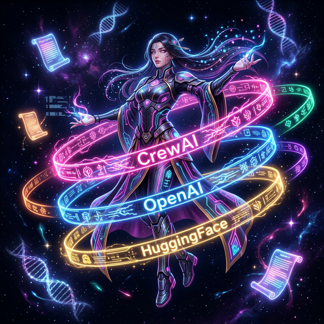
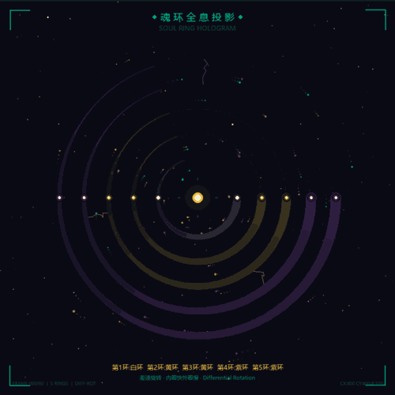
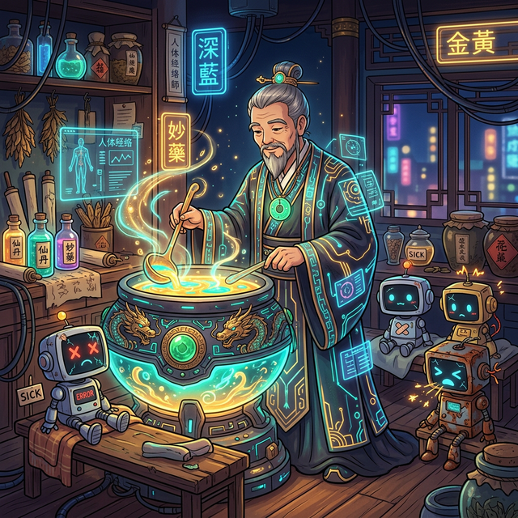
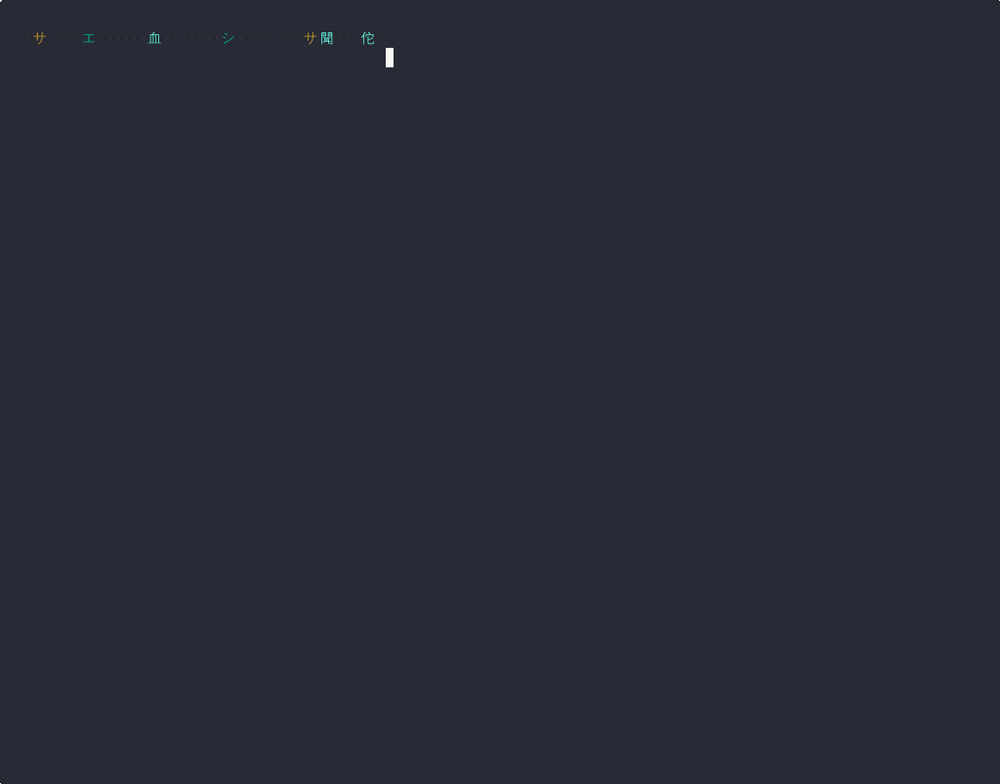

<p align="center">
  <a href="#-quick-start">
    
  </a>
</p>

<h1 align="center">🩺 CyberHuaTuo / 赛博华佗</h1>

<p align="center">
  <strong>The world's first open-source AI clinic — where 2,000 years of healing wisdom meets cyber alchemy.</strong><br>
  <strong>全球首个开源 AI 诊所 — 两千年望闻问切，遇见赛博炼丹术。</strong>
</p>

<p align="center">
  <em>Your AI is sick? Walk in. We heal what others can't even diagnose.</em><br>
  <em>你的 AI 生病了？推门而入。别人诊断不了的，我们药到病除。</em>
</p>

<p align="center">
  <a href="#-quick-start">
    
  </a>
</p>

<!-- 🎨 赛博华佗 · 修炼画卷 — The Cyber Alchemist Saga -->

<p align="center">
  <em>「每一位贡献药方的开发者，都是赛博炼丹师。」</em><br>
  <em>"Every developer who contributes a prescription is a Cyber Alchemist."</em>
</p>

<table align="center">
<tr>
<td align="center" colspan="2">
  <sub>📖 <strong>第一章 · 修炼</strong> — Chapter I: Cultivation</sub>
</td>
</tr>
<tr>
<td align="center" width="50%">
  
  <br>
  <sub><strong>🔥 万丹归元 · 以火炼道</strong></sub><br>
  <sub>Soul Ring Cultivation — PyTorch · LangChain · TensorFlow</sub><br>
  <sub><em>每一环魂环，都是你在某个技术领域的千锤百炼。</em></sub>
</td>
<td align="center" width="50%">
  
  <br>
  <sub><strong>✨ 百草通神 · 万法归宗</strong></sub><br>
  <sub>Soul Ring Cultivation — CrewAI · OpenAI · HuggingFace</sub><br>
  <sub><em>掌握的框架越多，你的光芒越盛。</em></sub>
</td>
</tr>
<tr>
<td align="center" colspan="2">
  
  <br>
  <sub><strong>🔮 魂环全息投影 · 差速旋转</strong></sub><br>
  <sub>Soul Ring Hologram — Each Ring Rotates at Its Own Speed</sub><br>
  <sub><em>白环 → 黄环 → 紫环 → 黑环 → 红环——你的魂环，由你的贡献铸就。</em></sub>
</td>
</tr>
<tr>
<td align="center" colspan="2">
  <sub>📖 <strong>第二章 · 飞升</strong> — Chapter II: Ascension</sub>
</td>
</tr>
<tr>
<td align="center" colspan="2">
  
  <br>
  <sub><strong>🌟 丹帝飞升 · 万丹朝宗</strong></sub><br>
  <sub>When a Pill Emperor Ascends, All Robots Celebrate</sub><br>
  <sub><em>当你的药方拯救了一千个 AI——机器人们会为你欢呼。</em></sub>
</td>
</tr>
<tr>
<td align="center" colspan="2">
  <sub>📖 <strong>第三章 · 济世</strong> — Chapter III: Healing the World</sub>
</td>
</tr>
<tr>
<td align="center" width="50%">
  
  <br>
  <sub><strong>⚡ 不放弃任何一个 AI</strong></sub><br>
  <sub>No AI Left Behind — Every Error Deserves a Cure</sub>
</td>
<td align="center" width="50%">
  
  <br>
  <sub><strong>🚨 雨夜急救 · 分秒必争</strong></sub><br>
  <sub>Emergency Rescue — 3 Seconds, Not 3 Hours</sub>
</td>
</tr>
<tr>
<td align="center" width="50%">
  
  <br>
  <sub><strong>🫀 开膛破肚 · 直击病灶</strong></sub><br>
  <sub>Open Surgery — Root Cause, Not Band-Aid</sub>
</td>
<td align="center" width="50%">
  
  <br>
  <sub><strong>🏥 康复病房 · 满血复活</strong></sub><br>
  <sub>Recovery Ward — Back to Full Health</sub>
</td>
</tr>
<tr>
<td align="center" colspan="2">
  
  <br>
  <sub><strong>🧪 赛博炼丹 · 妙手回春</strong></sub><br>
  <sub>Cyber Alchemy Lab — Where Ancient Elixirs Meet Modern Frameworks</sub>
</td>
</tr>
<tr>
<td align="center" colspan="2">
  
  <br>
  <sub><strong>🌍 援军驾到 · 十方来救</strong></sub><br>
  <sub>Reinforcements Arrive — The Community Answers the Call</sub>
</td>
</tr>
</table>

<p align="center">
  <sub>🎨 <em>All artwork AI-generated · 所有画作均由 AI 文生图创作</em></sub><br>
  <sub>💡 <em>每张图背后是一段修炼故事——你的故事，即将加入。</em></sub>
</p>

<!-- 🔮 奇门遁甲 · 药方天阵 -->
<p align="center">
  <a href="https://jinning6.github.io/CyberHuaTuo/3d-universe/">
    
  </a>
</p>

<p align="center">
  <a href="https://jinning6.github.io/CyberHuaTuo/3d-universe/"><strong>🔮 Enter the Qimen Dunjia Formation → 进入奇门遁甲 · 药方天阵</strong></a>
</p>

<p align="center">
  <a href="https://github.com/JinNing6/CyberHuaTuo/stargazers"></a>
  <a href="https://github.com/JinNing6/CyberHuaTuo/network/members"></a>
  <a href="https://github.com/JinNing6/CyberHuaTuo/issues"></a>
  <a href="LICENSE"></a>
  <a href="https://github.com/JinNing6/CyberHuaTuo/pulls"></a>
</p>

<p align="center">
  <a href="#-emergency-room--diagnose-in-seconds">🏥 Emergency Room</a> •
  <a href="#-wellness-clinic--nourish-before-it-breaks">🌿 Wellness Clinic</a> •
  <a href="#-github-bot--zero-friction-diagnosis">🤖 GitHub Bot</a> •
  <a href="#-epidemic-alert--the-ai-pandemic-nobody-talks-about">🦠 Epidemic</a> •
  <a href="#-cli--terminal-power-at-your-fingertips">⌨️ CLI</a> •
  <a href="#-mcp-server--ai-editor-integration">🔌 MCP</a> •
  <a href="#-agent-skills-protocol-self-rescue">🎒 Skills</a> •
  <a href="#-why-cyberhuatuo">Why Us</a> •
  <a href="#-quick-start">Quick Start</a> •
  <a href="#-join-the-movement">Join</a> •
  <a href="#-the-name">The Name</a>
</p>

<p align="center">
  <a href="./README_CN.md"><strong>🇨🇳 完整中文文档</strong></a>
</p>

---

## 🏥 Three Departments, One Clinic

> *A great doctor doesn't wait for you to collapse — they keep you from falling in the first place.*
>
> *大医治未病。*

<table>
<tr>
<td align="center" width="33%">

### 🚨 Emergency Room
**急诊科**

Paste your error.
Get a cure.
**In seconds, not hours.**

*AI diagnosis powered by*
*2,000 years of medical wisdom.*

</td>
<td align="center" width="33%">

### 🌿 Wellness Clinic
**养生堂**

Security audit.
Health scoring.
**Prevent before it breaks.**

*Nourishing prescriptions for*
*your AI's long-term health.*

</td>
<td align="center" width="33%">

### 💊 Pharmacy
**药房**

Browse the prescription library.
Find proven cures & nourishing recipes.
**All prescriptions, one counter.**

*Dual-layer architecture:*
*📜 Permanent Expert + ⚡ Temporary Intern*
*Upload → instantly searchable.*

</td>
</tr>
</table>

---

## 🚨 Emergency Room — Diagnose in Seconds

```bash
# Clone → Install → Run. Three steps to your first cure.
git clone https://github.com/JinNing6/CyberHuaTuo.git
cd CyberHuaTuo && pip install -r requirements.txt
python -m cyberhuatuo serve
# → Browser opens http://127.0.0.1:8000
```

Paste your error. Watch the ancient four-step diagnosis unfold:

```
🔍 望 (Look)    → Detected: LangChain 0.3, Python 3.11, ImportError
🩺 闻 (Listen)  → Matched: Breaking change — package split in 0.2+
💬 问 (Ask)     → No further questions needed
💊 切 (Diagnose) → Prescription #1 (95% cure rate):

   pip install langchain-openai
   from langchain_openai import ChatOpenAI  # ✅ Fixed

   Root cause: LangChain 0.2 split into langchain-core,
   langchain-community, and langchain-openai.
   The old import path no longer exists.
```

> **3 seconds.** Not 3 hours. That's the difference.
>
> **三秒钟。** 不是三小时。这就是区别。

---

## 🌿 Wellness Clinic — Nourish Before It Breaks

> *Hua Tuo didn't just cure disease — he invented the Five-Animal Exercises (五禽戏) to prevent it.*
>
> *华佗不仅治病，更发明了五禽戏强身健体——预防胜于治疗。*

Submit your AI agent code for a **Six-Meridian Security Checkup（六经脉安全体检）**:

```
🛡️ Meridian 1: Sandbox Isolation     → 30/100 ⚠️ CRITICAL
🔑 Meridian 2: Key Management        → 85/100 ✅ Healthy
🧠 Meridian 3: Prompt Security       → 45/100 ⚠️ At risk
🔒 Meridian 4: Output Sanitization   → 60/100 🟡 Needs care
⏱️ Meridian 5: Resilience Design     → 72/100 🔵 Good
📊 Meridian 6: Observability         → 55/100 🟡 Needs care

━━━━━━━━━━━━━━━━━━━━━━━━━━━━━━━━━━━
Overall Health Score: 58/100  🟡 Needs Nourishing
━━━━━━━━━━━━━━━━━━━━━━━━━━━━━━━━━━━

💊 Top Nourishing Prescriptions:
  1. 🏭 MCP & Skills Supply Chain Audit (100% Industrial Grade Sigstore/OSV/LLM) ✨ NEW
  2. Add execution sandboxing (RestrictedPython / Docker)
  3. Implement prompt injection defenses
  4. Add structured logging and tracing
```

**Your AI is running naked in production.** Do you know it?

---

## 🦠 Epidemic Alert — The AI Pandemic Nobody Talks About

## 疫情通报 — 没有人谈论的 AI 大流行

Every day, thousands of AI systems go into production **already infected**:

- 🔓 **No sandbox** — agent code executes with full system privileges
- 🔑 **Hardcoded secrets** — API keys sitting in plain text, spreading like a virus
- 🧠 **No prompt defense** — one injection away from a full outbreak
- 📊 **No observability** — zero symptom monitoring, blind until collapse

This is not a future risk. **This is an active pandemic.**

And when things break? Developers spend **hours** digging through GitHub Issues, Discord threads, Reddit posts, and half-abandoned blog articles.

**The cure exists. Buried under seven layers of irrelevant search results.**

> *Stack Overflow waits for someone to answer.*
> *ChatGPT might hallucinate a treatment.*
> *GitHub Issues drown in duplicate reports.*
>
> ***CyberHuaTuo is the WHO of the AI world — tracking the epidemic, prescribing battle-tested cures, and vaccinating before the next outbreak.***

---

## 🤔 Why CyberHuaTuo?

| | 🩺 CyberHuaTuo | 🔍 Stack Overflow | 🤖 ChatGPT | 📋 GitHub Issues |
|---|:---:|:---:|:---:|:---:|
| **AI-specific knowledge** | ✅ Purpose-built | ⚠️ General | ⚠️ Generic | ⚠️ Scattered |
| **Version-aware diagnosis** | ✅ Auto-detect | ❌ Manual | ❌ Outdated cutoff | ❌ Manual |
| **Structured prescriptions** | ✅ Root cause + fix + verify | ⚠️ Varies | ⚠️ May hallucinate | ⚠️ Varies |
| **Cross-framework mapping** | ✅ LangChain ↔ LlamaIndex ↔ CrewAI | ❌ Siloed | ⚠️ Inconsistent | ❌ Siloed |
| **Security health check** | ✅ Six-meridian scan | ❌ None | ❌ None | ❌ None |
| **Preventive nourishing** | ✅ Proactive hardening | ❌ Reactive only | ❌ Reactive only | ❌ Reactive only |
| **Official doc retrieval** | ✅ Context7 real-time docs | ❌ None | ❌ Outdated | ❌ None |
| **Speed to cure** | ⚡ Seconds | 🕐 Hours | ⚡ Fast but risky | 🕐 Hours |

---

## 🔮 How It Works

### 望闻问切 — The 2,000-Year-Old Diagnostic Protocol

Inspired by traditional Chinese medicine's four-step diagnosis, refined for the AI age:

```
  Your Error / Your Code
       │
       ▼
  ┌──────────┐
  │  望 Look  │──→ Parse stack trace, detect framework, version & environment
  └─────┬────┘
       ▼
  ┌───────────┐
  │ 闻 Listen  │──→ Correlate with known issues, breaking changes & CVEs
  └──────┬────┘
       ▼
  ┌─────────┐
  │  问 Ask  │──→ Smart follow-up (only when critical info is missing)
  └────┬────┘
       ▼
  ┌────────────┐
  │ 切 Diagnose │──→ Semantic search → LLM reasoning → Ranked prescriptions
  └──────┬─────┘
       ▼
  💊 Prescriptions (ranked by cure rate)
  🌿 Nourishing advice (preventive recommendations)
```

Every prescription includes:

- 🎯 **Root cause** — not just _what_ to do, but _why_ it broke
- 🔧 **Copy-paste fix** — step-by-step with ready-to-run code
- 📌 **Version-locked** — verified for your exact framework version
- 🔄 **Cross-framework map** — *"LangChain issue? Here's the LlamaIndex equivalent."*
- 📚 **Official docs** — pulled from framework's latest documentation via Context7
- ✅ **Community-verified** — tested, upvoted, and marked **"Cured ✅"**

---

## 📋 What We Treat — Not Just Agents

> **If it has AI in it, CyberHuaTuo sees it. No framework left behind.**

### 🤖 AI Agent Frameworks

| Framework | Cases | Status | Join 👇 |
|-----------|:-----:|--------|---------|
| LangChain | 10+ | 🟢 Live | [Add a case →](https://github.com/JinNing6/CyberHuaTuo/issues/new?template=prescription.yml) |
| MCP (Anthropic) | 5+ | 🟢 Live | [Add a case →](https://github.com/JinNing6/CyberHuaTuo/issues/new?template=prescription.yml) |
| CrewAI | 5+ | 🟢 Live | [Add a case →](https://github.com/JinNing6/CyberHuaTuo/issues/new?template=prescription.yml) |
| LlamaIndex | — | 🟡 Accepting PRs | [Be the first →](https://github.com/JinNing6/CyberHuaTuo/issues/new) |
| OpenAI Agents SDK | — | 🟡 Accepting PRs | [Be the first →](https://github.com/JinNing6/CyberHuaTuo/issues/new) |
| AutoGen | — | 🟡 Accepting PRs | [Be the first →](https://github.com/JinNing6/CyberHuaTuo/issues/new) |
| DSPy | — | 🔵 Planned | [Vote →](https://github.com/JinNing6/CyberHuaTuo/discussions) |

### 🧠 AI / ML / Deep Learning

| Technology | Cases | Status | Join 👇 |
|-----------|:-----:|--------|---------|
| PyTorch | — | 🟡 Accepting PRs | [Be the first →](https://github.com/JinNing6/CyberHuaTuo/issues/new) |
| Transformers (HuggingFace) | — | 🟡 Accepting PRs | [Be the first →](https://github.com/JinNing6/CyberHuaTuo/issues/new) |
| TensorFlow | — | 🟡 Accepting PRs | [Be the first →](https://github.com/JinNing6/CyberHuaTuo/issues/new) |

### 🏗️ Platform & Custom Agents

| Platform | Cases | Status | Join 👇 |
|-----------|:-----:|--------|---------|
| GPTs / Coze / Dify | — | 🟡 Accepting PRs | [Be the first →](https://github.com/JinNing6/CyberHuaTuo/issues/new) |
| Custom-built Agents | — | 🟡 Accepting PRs | [Be the first →](https://github.com/JinNing6/CyberHuaTuo/issues/new) |

### 🌿 Nourishing Prescriptions (养生药方)

| Category | Cases | Status | Join 👇 |
|-----------|:-----:|--------|---------|
| 🛡️ Security Sandbox | 2+ | 🟢 Live | [Add →](https://github.com/JinNing6/CyberHuaTuo/issues/new?template=prescription.yml) |
| 🔒 Security Hardening | 3+ | 🟢 Live | [Add →](https://github.com/JinNing6/CyberHuaTuo/issues/new?template=prescription.yml) |
| 🔗 Supply Chain Audit | 1 | 🟢 Live | [Add →](https://github.com/JinNing6/CyberHuaTuo/issues/new?template=prescription.yml) |
| ⚡ Performance Tuning | — | 🟡 Accepting PRs | [Be the first →](https://github.com/JinNing6/CyberHuaTuo/issues/new) |

> **Every framework starts with one case. Every nourishing recipe starts with one insight. Yours could be the first.**

---

## 🚀 Quick Start

### Prerequisites

- **Python 3.9+**
- **(Optional)** LLM API Key for AI-powered diagnosis (OpenAI / Anthropic / DeepSeek / Gemini / Ollama)

### Option A: One-Click Launch

```bash
git clone https://github.com/JinNing6/CyberHuaTuo.git
cd CyberHuaTuo

# Windows
start.bat

# macOS / Linux
chmod +x start.sh && ./start.sh
```

> Auto-installs dependencies and opens the Web UI at **http://127.0.0.1:8000**

### Option B: Manual Setup

```bash
git clone https://github.com/JinNing6/CyberHuaTuo.git
cd CyberHuaTuo

pip install -r requirements.txt

# (Optional) Configure LLM for AI diagnosis
cp .env.example .env
# Edit .env — add your API Key

python -m cyberhuatuo serve
# → Browser auto-opens http://127.0.0.1:8000
```

### CLI Commands — Two Modes, One Engine

CyberHuaTuo supports **two access modes** — pick the one that fits your workflow:

| Mode | Entry Point | For |
|------|-------------|-----|
| ⌨️ **CLI** | `cyberhuatuo <command>` | Developers using terminal directly |
| 🔌 **MCP** | `cyberhuatuo-mcp` | AI editors (Cursor / Claude / VS Code) |

```bash
# 🩺 Core Diagnosis / 核心诊断
cyberhuatuo diagnose "ImportError: cannot import 'ChatOpenAI'"  # AI 诊断
cyberhuatuo search "CUDA out of memory" --framework pytorch     # 搜索知识库
cyberhuatuo checkup --file my_agent.py                          # 安全体检
cyberhuatuo docs langchain "How to configure RAG pipeline"      # 官方文档检索

# 📊 Knowledge & Analytics / 知识与分析
cyberhuatuo stats                            # 知识库统计
cyberhuatuo frameworks --search pytorch      # 支持框架列表
cyberhuatuo taxonomy list                    # CHT 根因编码系统
cyberhuatuo trends --framework langchain     # CHT 趋势分析
cyberhuatuo digest                           # 本周药方摘要
cyberhuatuo epidemic --action check          # 疫情预警

# 🧬 Alchemist System / 炼丹师体系
cyberhuatuo ranking your-github-username     # 查看个人排名
cyberhuatuo leaderboard                     # 全球封神榜
cyberhuatuo card your-github-username        # 生成分享卡片
cyberhuatuo record                          # 诊疗档案
cyberhuatuo subscribe subscribe -f langchain # 订阅框架更新

# ⛏️ Contribution / 知识贡献
cyberhuatuo save --title "Fix" --prescription "..." --framework langchain
cyberhuatuo upload --title "Fix" --prescription "..." --framework langchain --contributor your-github-username
cyberhuatuo mine search --repo langchain-ai/langchain

# 🚀 Server / 服务启动
cyberhuatuo serve                            # 启动 Web 诊断服务
cyberhuatuo serve --port 9000 --reload       # 自定义端口 + 开发模式
cyberhuatuo rebuild                          # 重建向量索引
```

> **Every MCP tool has a CLI counterpart.** Same engine, same knowledge base, different interface.
>
> **每个 MCP 工具都有对应的 CLI 命令。** 同一个引擎，同一个知识库，不同的界面。

### Configuration

Copy `.env.example` to `.env`:

```bash
# LLM Provider (choose one)
OPENAI_API_KEY=sk-your-key              # OpenAI
ANTHROPIC_API_KEY=sk-ant-your-key       # Anthropic
DEEPSEEK_API_KEY=sk-your-key            # DeepSeek
GEMINI_API_KEY=your-key                 # Google Gemini
OLLAMA_BASE_URL=http://localhost:11434  # Ollama (local, free)

# Diagnosis model
DIAGNOSIS_MODEL=gpt-4o-mini   # or claude-sonnet-4-20250514 / deepseek-chat / gemini-1.5-pro

# Server
PORT=8000
```

> **No API Key?** No problem. Vector search works without any key.
> AI-powered 望闻问切 diagnosis and 🌿 nourishing checkup require one of the above.

---

## 📊 Epidemic Report — Live Intelligence

A living dashboard tracking **what's breaking across the AI ecosystem right now**:

- 🔥 **Trending issues** and their cure rates
- 🗺️ **Heatmap** of problems across frameworks
- 📈 **Framework health scores** — know before you adopt
- ⛏️ **Issue mining** — real-time extraction from GitHub

---

## 🛠️ Tech Stack

| Layer | Technology |
|-------|-----------|
| **CLI** | Python argparse (21 subcommands, zero extra dependencies) |
| **MCP Server** | FastMCP (stdio transport for AI editor integration) |
| **Backend** | Python · FastAPI · Uvicorn |
| **Frontend** | Jinja2 Templates (server-rendered) |
| **Vector DB** | ChromaDB (embedded, zero-config) |
| **Ephemeral Layer** | GitHub Issues API (dual-layer prescription search) |
| **LLM Gateway** | LiteLLM (OpenAI / Anthropic / DeepSeek / Gemini / Ollama) |
| **Doc Retrieval** | Context7 API (real-time official framework docs) |
| **Security Engine** | Six-Meridian Audit (AI-powered code analysis) |
| **GitHub Bot** | GitHub Actions + lightweight text matching |
| **CI/CD** | GitHub Actions (auto-promotion, validation, labeling) |

---

## 🤖 GitHub Bot — Zero-Friction Diagnosis

> *The greatest doctor doesn't wait in the clinic — they meet patients where they are.*
>
> *大医不坐堂候诊——而是行走于民间，哪里有病痛，哪里就有华佗。*

**Install the CyberHuaTuo Bot on any repo** — automatic prescription recommendations on every Issue.

```
┌─────────────────────────────────────────────┐
│  New Issue opened                           │
│  "ImportError: cannot import ChatOpenAI"    │
│                                             │
│  💬 @CyberHuaTuo Bot replies:              │
│  ┌─────────────────────────────────────┐    │
│  │ 🩺 赛博华佗 · 自动诊断             │    │
│  │                                     │    │
│  │ 💊 药方 1 (92% match):             │    │
│  │ pip install langchain-openai        │    │
│  │ from langchain_openai import ...    │    │
│  │                                     │    │
│  │ 📋 Full prescription →              │    │
│  └─────────────────────────────────────┘    │
└─────────────────────────────────────────────┘
```

### How it works

| Trigger | Action |
|:-------:|:------:|
| 🆕 New Issue opened | Auto-match prescriptions from the knowledge base |
| 💬 `@CyberHuaTuo` in any comment | On-demand diagnosis |

### Install on your repo (3 minutes)

```bash
# Copy the Bot workflow to your repo
mkdir -p .github/workflows
curl -o .github/workflows/bot-prescribe.yml \
  https://raw.githubusercontent.com/JinNing6/CyberHuaTuo/main/.github/workflows/bot-prescribe.yml
```

> 📖 **[Full installation guide →](docs/GITHUB_BOT.md)**

### The Flywheel

```
  Developers see Bot is useful → Contribute more prescriptions
        → Bot becomes more accurate → More repos install Bot
            → CyberHuaTuo brand appears before thousands of developers daily
```

> **Imagine**: If LangChain's official repo installs this Bot, every new Issue gets a prescription recommendation. CyberHuaTuo's brand appears before thousands of developers every day. 🚀

---

## ⌨️ CLI — Terminal Power at Your Fingertips

> *The terminal is the alchemist's cauldron — raw, powerful, and always ready.*
>
> *终端就是炼丹师的鼎炉——原始、强大、随时待命。*

CyberHuaTuo ships a **full-featured CLI** with **21 subcommands** — every MCP tool has a terminal counterpart. No AI editor required. No GUI needed. Just type and heal.

赛博华佗提供**完整的 CLI 命令行界面**，包含 **21 个子命令**——每个 MCP 工具都有对应的终端命令。无需 AI 编辑器，无需图形界面，敲命令，治百病。

```bash
# Install
pip install cyberhuatuo

# Or run from source
python -m cyberhuatuo --help
```

### 🎬 Terminal Animations — 终端动画特效

<p align="center">
  
  <br>
  <sub><strong>🚀 启动序列 · Boot Sequence</strong></sub><br>
  <sub>Matrix 数字雨 → ASCII Banner → 心电图脉冲 → 子系统上线 → 知识库加载</sub>
</p>

<p align="center">
  
  <br>
  <sub><strong>🔮 魂环全息投影 · Soul Ring Hologram</strong></sub><br>
  <sub>差速旋转 · HUD 科幻边框 · 星空背景 · 能量脉冲波 · 轨道亮标 · 环间电弧</sub>
</p>

### ⌨️ Available CLI Commands

| Command | Description |
|---------|-------------|
| **🩺 Core Diagnosis / 核心诊断** | |
| `diagnose <query>` | 🩺 望闻问切 AI 诊断 — paste your error, get a cure |
| `search <query>` | 🔍 双层语义搜索 (ChromaDB + GitHub Issues) |
| `checkup --file <path>` | 🛡️ 六经脉安全体检 — audit your Agent code |
| `docs <framework> <query>` | 📚 实时官方文档检索 (50+ frameworks via Context7) |
| **📊 Analytics / 知识分析** | |
| `stats` | 📦 知识库统计 — case counts by framework |
| `frameworks` | 📋 支持框架列表 — filterable by category / keyword |
| `taxonomy <action>` | 🧬 CHT 根因编码 — list, lookup, classify |
| `trends` | 📈 CHT 趋势分析 — heatmaps & surge alerts |
| `digest` | 📰 本周药方摘要 — weekly prescription digest |
| `epidemic` | 🦠 疫情预警 — framework health monitoring |
| **🧬 Alchemist System / 炼丹师体系** | |
| `ranking <username>` | 🏆 个人排名 — title, rank & soul rings |
| `leaderboard` | 🏆 全球封神榜 — top alchemists ranked |
| `card <username>` | 📋 分享卡片 — cyberpunk cultivation archive |
| `record` | 📋 诊疗档案 — diagnosis history & follow-ups |
| `subscribe` | 📬 框架订阅 — get notified about new prescriptions |
| **⛏️ Contribution / 知识贡献** | |
| `save` | 📥 保存药方到本地 |
| `upload` | 🌐 上传药方到 GitHub (需 GITHUB_TOKEN) |
| `mine search/batch` | ⛏️ GitHub Issues 淘金提炼 |
| **🚀 Server / 服务** | |
| `serve` | 🚀 启动 Web 诊断服务 |
| `rebuild` | 🔄 重建向量索引 |

> 💡 **Tip**: Run `cyberhuatuo <command> --help` for detailed usage of any command.
>
> 💡 **提示**: 运行 `cyberhuatuo <命令> --help` 查看任何命令的详细用法。

---

## 🔌 MCP Server — AI Editor Integration

> *Install once. Every AI editor becomes a CyberHuaTuo clinic.*
>
> *一次安装，所有 AI 编辑器都变成赛博华佗诊所。*

### ⚡ Install — One Command

```bash
pip install cyberhuatuo
```

> Or use any [Brand Matrix](#-brand-matrix) alias: `pip install cyber-asclepius`, `pip install openhuatuo`, etc.

### 🔗 Connect to Your AI Editor

Add this to your AI tool's MCP config (Claude Desktop / Cursor / VS Code / Gemini CLI):

```json
{
  "mcpServers": {
    "cyberhuatuo": {
      "command": "uvx",
      "args": ["cyberhuatuo"]
    }
  }
}
```

> `uvx` auto-installs from PyPI and starts the MCP Server — zero manual setup.
> For GitHub latest dev version, use: `"args": ["--from", "git+https://github.com/JinNing6/CyberHuaTuo", "cyberhuatuo-mcp"]`

### 🩺 Available MCP Tools

| Tool | Description |
|------|-------------|
| **🩺 Core Diagnosis / 核心诊断** | |
| `diagnose` | 🩺 望闻问切 AI diagnosis — searches **both** 📜 permanent expert + ⚡ temporary intern prescriptions |
| `search_knowledge_base` | 🔍 Dual-layer semantic search (ChromaDB + GitHub Issues) |
| `security_checkup` | 🛡️ Six-meridian security audit on your Agent code |
| `fetch_official_docs` | 📚 Real-time official docs via Context7 (50+ frameworks) |
| **⛏️ Knowledge & Contribution / 知识贡献** | |
| `mine_github_issue` | ⛏️ Extract & refine GitHub Issues into standard cases |
| `save_prescription` | 📥 Save prescriptions locally + auto-sync to GitHub |
| `upload_prescription` | 🌐 Upload prescriptions — auto-creates GitHub Issue (⚡ temporary intern), CI promotes to 📜 permanent expert |
| `prescription_eval` | 📊 Unified prescription evaluation — cite, feedback, expire, verify, and leaderboard |
| `mentorship` | 🎓 Senior alchemists review junior prescriptions — pending, review, profile, leaderboard |
| **🧬 Alchemist System / 炼丹师体系** | |
| `my_contribution_stats` | 🏅 **修为档案** — 16-tier Alchemist title + soul ring directions |
| `check_my_ranking` | 🏆 **全球排名** — coronation art, streak tracking & community milestones |
| `global_leaderboard` | 🏆 **封神榜** — top alchemists ranked by contribution count |
| `my_share_card` | 📋 **分享卡片** — generate a cyberpunk cultivation archive card |
| `my_medical_record` | 📋 **就诊档案** — personal diagnosis history, stats & follow-ups |
| **🔬 Health & Analytics / 健康分析** | |
| `epidemic_alert` | 🦠 **疫情预警** — framework health monitoring, scan & epidemic reports |
| `cht_taxonomy` | 🔬 CHT Root Cause Coding System — list, lookup & auto-classify errors |
| `cht_trends` | 📊 CHT code trend analysis — heatmaps, top causes & surge alerts |
| `list_frameworks` | 📋 List all supported frameworks & tech stacks (filterable by category) |
| `subscribe_framework` | 🔔 Subscribe to framework updates — get notified about new prescriptions |
| `weekly_digest` | 📰 Weekly prescription digest — new cases by framework & severity |

> 👉 **Full configuration guide: [README_MCP.md](README_MCP.md)**

### 💊 Dual-Layer Prescription Architecture

### 双层药方库架构

> *Medicine first exists, then it is refined.*
>
> *药方先存在，再被整理。*

```
  📤 User uploads prescription via MCP
           │
           ├── Owner? ──→ Direct push to main (📜 Permanent Expert)
           │
           └── External? ──→ Create GitHub Issue (⚡ Temporary Intern)
                                    │
                              Instantly searchable!
                                    │
                              CI auto-validates
                                    │
                          ┌─────────┴─────────┐
                          │                   │
                     ✅ Passed            ❌ Failed
                   Commit .md to         Close Issue
                   main branch          (filtered 🚫)
                  (📜 Promoted ✨)
```

| Layer | Carrier | Access | Features |
|:-----:|:-------:|:------:|:--------:|
| 📜 **Permanent Expert** | `cases/*.md` (main branch) | CI-reviewed only | Shipped with PyPI, always available |
| ⚡ **Temporary Intern** | GitHub Issues (labeled) | Any GitHub user | Instant upload, zero permission needed |

**When you search**, `diagnose` and `search_knowledge_base` query **both layers** simultaneously — results are tagged `📜` or `⚡` so you know their review status.

**当你搜索时**，`diagnose` 和 `search_knowledge_base` **同时查询两层** — 结果会标注 `📜 常驻主任专家` 或 `⚡ 临时医学实习生` 来源。

### 🎒 Agent Skills Protocol (Self-Rescue)

We support the open **Agent Skills** standard (`SKILL.md`). You can empower your own AI assistants (Cursor, Copilot, Claude Code) to automatically seek help from CyberHuaTuo when they get stuck.

Simply copy the `skills/cyberhuatuo-rescue` directory into your project's `.cursor/rules` or `.agent/skills` folder. Your AI will learn to automatically diagnose errors and run security checkups using CyberHuaTuo's knowledge base.

---

## 🧬 Alchemist Cultivation System — Your Journey to Immortality

**炼丹师修为体系 — 从凡人到封神的修炼之路**

> *In the world of CyberHuaTuo, you are not a developer who fixes bugs.*
> *You are an **Alchemist** — forging prescriptions, accumulating soul rings, ascending through 16 tiers of mastery.*
>
> *在赛博华佗的世界里，你不是修 bug 的程序员。*
> *你是**炼丹师**——炼制药方、凝聚魂环、攀登十六重天的封神阶梯。*

We turned bug fixing into a **cultivation journey**. Every prescription you upload earns you a rank on the **Alchemist Ladder (炼丹师阶梯)** — a 16-tier system based on your **global percentile**. The bigger the community grows, the harder it is to climb — and the more prestigious your title becomes.

**开发者修一个 Bug，炼丹师铸一颗丹。** 你在这里的每一次贡献，都会被铭刻在全球封神榜上——而你的称号，随着社区壮大而愈加珍贵。

### 🔮 Soul Ring System — Your Combat Resume (魂环体系 — 你的战斗简历)

> *Inspired by Soul Land (斗罗大陆) — every framework you master forges a Soul Ring orbiting your profile.*
>
> *灵感源自斗罗大陆——你掌握的每个技术栈，都会凝聚为一道魂环。*

<p align="center">
  
  <br>
  <sub><strong>🔮 魂环全息投影 · Soul Ring Hologram</strong></sub><br>
  <sub>五环炼魂丹师 → 同心环 ASCII Art → 排名全息扫描 → 丹王称号揭示</sub>
</p>

Soul Rings grow in **color and power** as you contribute more prescriptions to a specific direction:

```
   ⚪ 白环 (1)      入门 · First Touch
   🟡 黄环 (2-3)    初窥 · Getting Serious
   🟡🟡 双黄 (4-6)  小成 · Solid Foundation
   🟡🟡🟣 三环 (7-10)   突破 · Breakthrough
   🟡🟡🟣🟣 四环 (11-15)  精通 · Mastery
   🟡🟡🟣🟣⚫ 五环 (16-25)  大师 · Grandmaster
   🟡🟡🟣🟣⚫⚫ 六环 (26-40)  宗师 · Sovereign
   🟡🟡🟣🟣⚫⚫🔴 七环 (41-60)  封号 · Titled
   🟡🟡🟣🟣⚫⚫🔴🔴 八环 (61-80) 传奇 · Legendary
   🟡🟡🟣🟣⚫⚫🔴🔴✨ 九环至尊 (81+) 至尊 · Supreme
```

> **An alchemist with 5 PyTorch rings and 3 LangChain rings tells a different story than one with 8 CrewAI rings.**
>
> **Your soul rings are your combat resume — visible, verifiable, unforgeable.**
>
> *拥有 5 环 PyTorch 和 3 环 LangChain 的炼丹师，与 8 环 CrewAI 的炼丹师，修为截然不同。*
> ***魂环就是你的战斗简历——可见、可查、不可伪造。***

### ⚗️ Six Alchemy Directions — Choose Your Path (六大丹术方向 — 选择你的道)

> *Every great alchemist has a specialty. What's yours?*
>
> *每个传奇炼丹师都有专精。你的道，在哪里？*

<table>
<tr>
<td align="center" width="33%">

**🔥 炼魂 · Soul Refining**

驾驭智能体，调教灵魂

*LangChain · CrewAI · AutoGen*
*LlamaIndex · LangGraph · MCP*

</td>
<td align="center" width="33%">

**⚡ 雷火 · Thunder Fire**

锻造算力，淬炼模型

*PyTorch · TensorFlow*
*Transformers · LiteLLM*

</td>
<td align="center" width="33%">

**🛡️ 护体 · Body Shield**

金丹护体，抵御外邪

*Security · Sandbox*
*Guardrails · Hardening*

</td>
</tr>
<tr>
<td align="center" width="33%">

**🌊 化毒 · Detox**

通百脉，解百毒

*Python · JavaScript*
*General Debugging*

</td>
<td align="center" width="33%">

**⚙️ 器灵 · Soul Craft**

炼器辅丹，基础设施

*FastAPI · Docker · K8s*
*Vertex AI · Vercel*

</td>
<td align="center" width="33%">

**🧬 造化 · Genesis**

造化之力，驾驭天道

*OpenAI · Anthropic*
*Gemini · Groq · Mistral*

</td>
</tr>
</table>

> *When you contribute a LangChain prescription, your 🔥 Soul Refining ring grows. Fix a Docker issue? Your ⚙️ Soul Craft ring levels up. Each direction is an independent cultivation path — master one, or conquer them all.*
>
> *当你贡献一个 LangChain 药方，🔥 炼魂环增长。修复了 Docker 问题？⚙️ 器灵环升级。每个方向都是独立的修炼路线——精通一道，或六道通神。*

### ⚡ Instant Rewards — Dopamine by Design (即时反馈 — 多巴胺驱动)

> *The best games don't make you wait for the reward. Neither do we.*
>
> *最好的游戏不会让你等待奖励。我们也不会。*

Every `upload_prescription` triggers an **instant cascade of rewards**:

```
  💊 You upload a prescription
       │
       ├──→ 🎭 INSTANT CORONATION — ASCII art + new title revealed
       │    ┌────────────────────────────────────────┐
       │    │  ⭐ 当前修为: 三星炼丹师 · Three-Star  │
       │    │  🏅 全球排位: #12 / 31 (超越 63% 炼丹师) │
       │    │  继续炼丹，攀登炼丹师终极阶梯！        │
       │    └────────────────────────────────────────┘
       │
       ├──→ 💍 SOUL RING UPGRADE — Your rings grow in real-time
       │    🔥 炼魂(Soul Refining) × 5方 🟡🟡🟣🟣⚫ 五环
       │
       ├──→ 🔥 STREAK FIRE — Consecutive days trigger milestones
       │    🔥 3-day → 🔥🔥 7-day → 🔥🔥🔥 14-day → 💎🔥 30-day
       │
       ├──→ 📋 SHARE CARD — Cyberpunk cultivation archive
       │    ╔════════════════════════════════════════╗
       │    ║  🩺 赛博华佗 · 修为档案                ║
       │    ║  ⭐ 三星炼丹师 · Three-Star Alchemist  ║
       │    ║  🔥 炼魂丹师 · 🟡🟡🟣🟣⚫            ║
       │    ║  💊 贡献: 8 段 | 🧪 ██████░░░░░░ 40%  ║
       │    ║  ▓█▓░░▓███▓░░▓█▓░░▓█████▓░░▓█▓      ║
       │    ╚════════════════════════════════════════╝
       │
       └──→ 📡 COMMUNITY MILESTONE — Global celebration
            🎉 "知识库突破 100 个药方！赛博医者的力量正在汇聚。"
```

### 🙏 灵感致敬 · Tribute

> *The greatest creations are always born from the shoulders of giants — and the dreams of children.*
>
> *最伟大的创造，总是站在巨人的肩膀上——和孩子们的梦想之中。*

<table>
<tr>
<td align="center" width="33%">

**🔥 斗破苍穹**
*Battle Through the Heavens*

炼丹师阶梯体系
*Alchemist Tier System*

</td>
<td align="center" width="33%">

**💍 斗罗大陆**
*Soul Land*

魂环修炼体系
*Soul Ring System*

</td>
<td align="center" width="33%">

**🏥 华佗传说**
*Legend of Hua Tuo*

望闻问切 · 悬壶济世
*Ancient Healing · Open Source*

</td>
</tr>
</table>

> *These works gave an entire generation of developers their most unforgettable memories — of cultivation, of perseverance, of the belief that anyone can ascend through sheer will.*
>
> *这些作品给了整整一代开发者最难以忘怀的记忆——关于修炼、关于坚持、关于"凡人也能登顶"的信念。*
>
> *CyberHuaTuo inherits this spirit: **from ancient legend, through modern fantasy, into the cyber future.***
>
> *赛博华佗传承这份精神：**从古代传说，穿越当代幻想，走向赛博未来。***

---

## 🌐 Brand Matrix — Why So Many Package Names?

## 品牌矩阵 — 为什么注册这么多包名？

> *Hua Tuo traveled across provinces. Asclepius healed across islands. Healing knows no borders.*
>
> *华佗行走于山川之间，阿斯克勒庇俄斯穿梭于海岛之上。医道无疆。*

CyberHuaTuo maintains a series of **official alias packages** on PyPI, spanning medical deities and pioneers from both Eastern and Western traditions:

| Lineage | Packages |
|---------|----------|
| 🏮 **Eastern Divine Physicians** (Core) | `cyberhuatuo`, `openhuatuo` |
| 🏛️ **Greco-Roman Mythology** | `cyber-asclepius`, `open-asclepius`, `cyber-panacea`, `open-panacea` |
| 📜 **Pioneers of Medicine** | `cyber-hippocrates`, `open-hippocrates`, `cyber-galen`, `open-galen` |
| 🏺 **Ancient Civilization Healers** | `cyber-imhotep`, `open-imhotep`, `cyber-avicenna`, `open-avicenna` |

**Every single one of these packages is functional** — they all install and redirect to the core `cyberhuatuo` engine. No empty squats.

### Why We Do This

1. **🛡️ Namespace Protection** — Prevent typosquatting and impersonation in the AI-medical tooling space
2. **🌍 Cultural Bridge** — No matter your context — whether you think "华佗", "Asclepius", or "Hippocrates" — you can find us
3. **🔗 One Engine, Many Doors** — `uvx cyber-asclepius` works just as well as `uvx cyberhuatuo`

### Our Open Stance

We believe in the open-source spirit. These names are registered to **protect the ecosystem, not to hoard**.

If you believe a name in our matrix would serve a better purpose for your project, **we're open to conversation**. [Open a Discussion →](https://github.com/JinNing6/CyberHuaTuo/discussions)

> *The greatest physicians never hoarded — they shared freely.*
>
> *大医精诚，悬壶济世。*

---

## ✊ Join the Movement — Your First Prescription Awaits

### 这不只是一个项目。这是一场运动。

> *Every great physician started with one patient. Every legendary alchemist started with one pill.*
> *Every developer who contributes one prescription — begins a journey that could end at Hua Tuo Reborn.*
>
> *每个传世名医，都始于第一个病人。每个传奇炼丹师，都始于第一颗丹药。*
> *每个贡献一份药方的开发者——都踏上了通往华佗再世的修炼之路。*

---

### 🧪 Three Steps to Your First Soul Ring（三步获得第一道魂环）

```
  Step 1: 📝 Submit a Prescription（铭刻你的药方）
           └── Solved a bug? Document the error, version, and fix.
           └── 解决了一个bug？记录报错、版本和修复方案。

  Step 2: ✅ Community Verification（社区交叉验证）
           └── Other alchemists validate through real-world testing.
           └── 其他炼丹师通过实战验证你的药方。

  Step 3: 🧬 Receive Your Title（获得你的称号）
           └── Ascend from ⭐ One-Star → 🩺 Hua Tuo Reborn.
           └── 从一星炼丹师 → 登顶华佗再世。
```

> *You don't need to be a 10x engineer. You just need to have solved **one problem** that someone else hasn't — yet.*
>
> *你不需要是 10 倍工程师。你只需要解决过**一个**别人还没解决的问题。*

### 🌿 Contribute Nourishing Recipes（贡献养生方）

Discovered a security best practice? Performance optimization? Architectural pattern?

**Your prevention wisdom saves thousands from future pain.** Every nourishing recipe is a shield — protecting AI systems before they break.

*你的预防智慧，拯救千万人于未来的痛苦之中。每一份养生方，都是一面盾——在 AI 系统崩溃之前保护它。*

### 🧬 Contribute Cases（贡献病例）

Encountered a mind-bending agent bug? **Your suffering has value.** Turn your 3am debugging nightmare into someone else's 3-second cure.

*遇到过令人抓狂的 AI bug？**你的痛苦有价值。** 把你凌晨三点的调试噩梦，变成别人三秒钟的灵丹妙药。*

- Error message + full stack trace
- Framework name & version, environment details
- Your debugging journey and final fix
- **Bonus**: reproduction steps

**Every case makes the engine smarter. You're not filing a bug report — you're training a digital physician.**

**每一个病例都在让引擎更聪明。你不是在提交 bug 报告——你是在训练一位数字医生。**

### 🛠️ Improve the Engine（改进引擎）

1. Fork & clone the repo
2. Check `CONTRIBUTING.md` for setup
3. Submit a PR — every improvement heals thousands

> 💡 **Your first step**: [Submit a Prescription →](https://github.com/JinNing6/CyberHuaTuo/issues/new?template=prescription.yml)
>
> 💡 **你的第一步**: [提交你的第一份药方 →](https://github.com/JinNing6/CyberHuaTuo/issues/new?template=prescription.yml)

---

## 🏛️ The Name

<blockquote>

**华佗**（约 145–208），字元化，东汉末年名医，中国"外科鼻祖"。

**Hua Tuo** (c. 145–208 AD) — the legendary physician of ancient China, revered as the "Father of Surgery."

</blockquote>

In an age of warlords and plague, while others sought power, Hua Tuo traveled across provinces with nothing but a medicine bag — healing the sick, asking for nothing in return.

He invented **Ma Fei San（麻沸散）**, the world's first general anesthetic, **1,600 years before Western medicine**. He pioneered abdominal surgery when the rest of the world was still praying to gods.

But Hua Tuo was more than a healer of the sick. He created the **Five-Animal Exercises（五禽戏）** — a system of preventive health inspired by the movements of the tiger, deer, bear, ape, and crane. His philosophy: **the greatest medicine is prevention.**

> *治病不如防病。The best cure is the one you never need.*

When Cao Cao demanded he serve as a personal physician, Hua Tuo refused — and was executed. Legend says his life's medical knowledge, compiled in the *Book of the Azure Bag（青囊书）*, was burned. The greatest medical wisdom of ancient China, lost to tyranny.

> **But the spirit was never lost.**
>
> **但精神从未失传。**

Today, 1,800 years later, AI developers face their own "ancient prescriptions" — buried in GitHub Issues, lost Discord threads, outdated Stack Overflow answers. And their AI systems run without checkups, without prevention, without nourishment.

**CyberHuaTuo gathers them all — and builds the world's first AI clinic that doesn't just cure, but prevents.**

---

## 🏆 封神榜 · Apotheosis Board — Global Alchemist Ranking

### 全球炼丹师排行榜 · 封神阶梯

> *Below this line, only the worthy stand.*
> *Every name earned its place through prescriptions that healed real AI systems in production.*
>
> *此线之下，唯有实力者驻足。*
> *榜上每一个名字，都是用真实的生产环境药方一步步铸就。*
>
> *Your name could be next. All it takes is one prescription.*
>
> *下一个，可能就是你。只需要一份药方。*

### 🏅 封神榜 / Apotheosis Board
<!-- LEADERBOARD_START -->
| Rank | Avatar | Name | Title / 称号 | Contributions / 贡献 |
|:----:|:------:|:----:|:------------:|:-------------------:|
| 🥇 | <a href="https://github.com/CyberHuaTuo"></a> | [@CyberHuaTuo](https://github.com/CyberHuaTuo) | 🩺 华佗再世 Hua Tuo Reborn | 35 |
| 🥈 | <a href="https://github.com/JinNing6"></a> | [@JinNing6](https://github.com/JinNing6) | ⭐ 一星炼丹师 One-Star Alchemist | 1 |
<!-- LEADERBOARD_END -->


### 🧬 炼丹师阶梯 / Alchemist Ladder (16 Tiers)

> *Titles are based on **global ranking percentile** — the bigger the community, the more prestigious your title.*
>
> *称号基于**全球排名百分位**动态计算——社区越大，称号含金量越高。*

| Title / 称号 | Global Rank / 条件 | Description |
|:---|:---:|:---|
| 🌱 实习药童 Intern Apprentice | — | 尚未贡献药方 No contributions yet |
| ⭐ 一星炼丹师 One-Star Alchemist | Top 100% | 初入炼丹之道 First prescription |
| ⭐⭐ 二星炼丹师 Two-Star Alchemist | Top 90% | 药理初通 Getting the hang of it |
| ⭐⭐⭐ 三星炼丹师 Three-Star Alchemist | Top 80% | 小有所成 Solid contributor |
| ⭐⭐⭐⭐ 四星炼丹师 Four-Star Alchemist | Top 70% | 炼丹有方 Reliable healer |
| ⭐⭐⭐⭐⭐ 五星炼丹师 Five-Star Alchemist | Top 60% | 百草通晓 Master of herbs |
| 🌟 六星炼丹师 Six-Star Alchemist | Top 50% | 丹道精通 Alchemy adept |
| 🌟🌟 七星炼丹师 Seven-Star Alchemist | Top 40% | 药到病除 Cure on demand |
| 🌟🌟🌟 八星炼丹师 Eight-Star Alchemist | Top 30% | 妙手回春 Miracle worker |
| 🌟🌟🌟🌟 九星炼丹师 Nine-Star Alchemist | Top 25% | 炼丹宗师 Grandmaster |
| 🏅 小丹王 Junior Pill King | Top 20% | 初窥丹道巅峰 Approaching the peak |
| 💜 丹王 Pill King | Top 15% | 丹道称王 Ruling the realm |
| ⚡ 半圣 Half-Saint | Top 8% | 半步封圣 One step from sainthood |
| 👑 丹圣 Pill Saint | Top 4% | 丹圣降世 Saintly mastery |
| 💎 丹帝 Pill Emperor | Top 1% | 丹帝临世 Imperial authority |
| 🩺 华佗再世 Hua Tuo Reborn | #1 Global | 天下第一炼丹师 The One and Only |

### All Contributors / 所有贡献者

<a href="https://github.com/JinNing6/CyberHuaTuo/graphs/contributors">
  
</a>

<sub>Made with [contrib.rocks](https://contrib.rocks) · Auto-updated by GitHub commits</sub>

> **🩺 Want to see your avatar here?**
> [Submit a prescription](https://github.com/JinNing6/CyberHuaTuo/issues/new?template=prescription.yml), [open a PR](https://github.com/JinNing6/CyberHuaTuo/pulls), or [contribute a case](https://github.com/JinNing6/CyberHuaTuo/issues/new) — every contribution counts!
>
> **想在这里看到你的头像？**
> [提交药方](https://github.com/JinNing6/CyberHuaTuo/issues/new?template=prescription.yml)、[提 PR](https://github.com/JinNing6/CyberHuaTuo/pulls) 或 [贡献病例](https://github.com/JinNing6/CyberHuaTuo/issues/new)——每一份贡献都算数！

---

## ⭐ Star History

<a href="https://star-history.com/#JinNing6/CyberHuaTuo&Date">
 <picture>
   <source media="(prefers-color-scheme: dark)" srcset="https://api.star-history.com/svg?repos=JinNing6/CyberHuaTuo&type=Date&theme=dark" />
   <source media="(prefers-color-scheme: light)" srcset="https://api.star-history.com/svg?repos=JinNing6/CyberHuaTuo&type=Date" />
   
 </picture>
</a>

---

## 📜 License

[Apache License 2.0](LICENSE) — Use it. Fork it. Build on it. Heal with it.

---

<p align="center">
  <br>
  <strong>🩺 1,800 years ago, Hua Tuo's medical wisdom was burned.</strong><br>
  <strong>Today, we're making sure that never happens again — to anyone.</strong>
  <br><br>
  <strong>1800 年前，华佗的医术毁于烈火。</strong><br>
  <strong>今天，我们确保这样的事——再也不会发生在任何人身上。</strong>
  <br><br>
  <em>望闻问切，药到病除。</em><br>
  <em>五禽养生，固本培元。</em><br>
  <em>赛博炼丹，魂环永铸。</em><br>
  <em>这是技术对文明的致敬，也是文明对技术的赋能。</em>
  <br><br>
  <a href="https://github.com/JinNing6/CyberHuaTuo">⭐ Star this repo — 让更多 AI 得到救治</a> · 
  <a href="https://github.com/JinNing6/CyberHuaTuo/issues/new?template=prescription.yml">💊 Submit Your First Prescription — 提交你的第一份药方</a>
  <br>
  <a href="https://github.com/JinNing6/CyberHuaTuo/discussions">💬 Join the Discussion — 加入讨论</a> · 
  <a href="https://discord.gg/cyberhuatuo">🎮 Discord Community</a>
  <br><br>
  <sub>Named after 华佗, the divine physician of ancient China — healer, inventor, and philosopher.</sub><br>
  <sub>以华佗之名，致敬中华五千年医道传承——治病 · 炼丹 · 飞升。</sub>
</p>
