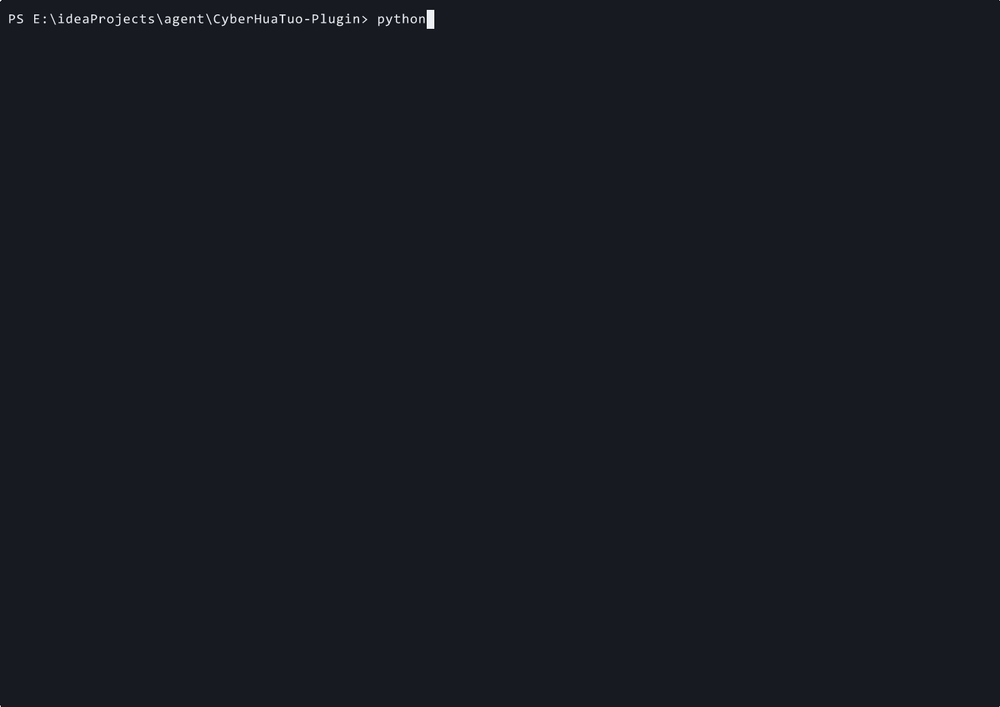

<p align="center">
  <a href="#-快速开始">
    
  </a>
</p>

<h1 align="center">🩺 赛博华佗 / CyberHuaTuo</h1>

<p align="center">
  <strong>AI Agent 报错急诊室 — 粘贴 MCP / LangChain / CrewAI / OpenAI SDK traceback，直接给病灶、根因、可执行修复和验证步骤。</strong><br>
  <strong>AI Agent Error Doctor — paste a traceback, get a runnable prescription.</strong>
</p>

<p align="center">
  <em>先急诊救命，再进入赛博华佗世界观。</em><br>
  <em>你的 AI 生病了？粘贴报错，先开药方。</em>
</p>

---

## 🚨 急诊入口：先粘贴报错

**AI Agent 报错急诊室** — 粘贴 MCP / LangChain / CrewAI / OpenAI SDK 的 traceback，赛博华佗直接给病灶、根因、可执行修复和验证步骤。

```bash
python -m cyberhuatuo diagnose "Traceback ... from langchain import ChatOpenAI ..." --framework langchain --top-k 1
```

**来自当前仓库 CLI 的真实录制：**

<p align="center">
  
</p>

**这次急诊返回的药方：**

```bash
pip install langchain-openai
```

```python
from langchain_openai import ChatOpenAI
```

这条急诊路径直接使用本地药方库；即使还没有配置 LLM API Key，也能先给出可复制的命中药方。配置模型 Key 后，可以继续使用更深度的 AI 望闻问切。

---

<p align="center">
  <a href="#-快速开始">
    
  </a>
</p>

<!-- 🎨 AI 文生图画廊 · CyberHuaTuo Gallery -->
<table align="center">
<tr>
<td align="center" width="50%">
  
  <br>
  <sub><strong>⚡ 不放弃任何一个 AI</strong></sub><br>
  <sub>No AI Left Behind</sub>
</td>
<td align="center" width="50%">
  
  <br>
  <sub><strong>🚨 雨夜急救</strong></sub><br>
  <sub>Emergency Rescue</sub>
</td>
</tr>
<tr>
<td align="center" width="50%">
  
  <br>
  <sub><strong>🫀 开膛手术</strong></sub><br>
  <sub>Open Surgery</sub>
</td>
<td align="center" width="50%">
  
  <br>
  <sub><strong>🏥 康复病房</strong></sub><br>
  <sub>Recovery Ward</sub>
</td>
</tr>
</table>

<p align="center">
  <sub>🎨 <em>所有画作均由 AI 文生图创作 · All artwork AI-generated</em></sub>
</p>

<p align="center">
  <a href="https://github.com/JinNing6/CyberHuaTuo-Plugin/stargazers"></a>
  <a href="https://github.com/JinNing6/CyberHuaTuo-Plugin/network/members"></a>
  <a href="https://github.com/JinNing6/CyberHuaTuo-Plugin/issues"></a>
  <a href="LICENSE"></a>
  <a href="https://github.com/JinNing6/CyberHuaTuo-Plugin/pulls"></a>
</p>

<p align="center">
  <a href="#-急诊科--三秒出药方">🏥 急诊科</a> •
  <a href="#-养生堂--防病于未然">🌿 养生堂</a> •
  <a href="#-疫情通报--没有人谈论的-ai-大流行">🦠 疫情</a> •
  <a href="#-mcp-server--接入-ai-编辑器">🔌 MCP</a> •
  <a href="#-agent-skills-协议-ai-自救指南">🎒 Skills</a> •
  <a href="#-为什么选择赛博华佗">为什么</a> •
  <a href="#-快速开始">快速开始</a> •
  <a href="#-加入这场运动">加入</a> •
  <a href="#-华佗">华佗</a>
</p>

<p align="center">
  <a href="./README_CN.md"><strong>🇨🇳 中文</strong></a> •
  <a href="./README.md"><strong>🇬🇧 English</strong></a>
</p>

---

## 🏥 三大科室，一个诊所

> *大医治未病。上医治未病，中医治欲病，下医治已病。*
>
> *A great doctor doesn't wait for you to collapse — they keep you from falling in the first place.*

<table>
<tr>
<td align="center" width="33%">

### 🚨 急诊科
**Emergency Room**

粘贴你的报错，
获得药方。
**三秒钟，不是三小时。**

*传承两千年医道智慧*
*望闻问切，药到病除。*

</td>
<td align="center" width="33%">

### 🌿 养生堂
**Wellness Clinic**

安全体检。
健康评分。
**防病于未然。**

*六经脉全面扫描*
*滋补药方，固本培元。*

</td>
<td align="center" width="33%">

### 💊 药房
**Pharmacy**

浏览药方库。
查找验方与养生方。
**所有药方，一柜通取。**

*来自社区验证的*
*AI 生态实战良方。*

</td>
</tr>
</table>

---

## 🚨 急诊科 — 三秒出药方

```bash
# 克隆 → 安装 → 启动。三步获得你的第一张药方。
git clone https://github.com/JinNing6/CyberHuaTuo-Plugin.git
cd CyberHuaTuo && pip install -r requirements.txt
python -m cyberhuatuo serve
# → 浏览器自动打开 http://127.0.0.1:8000
```

粘贴你的报错，看两千年望闻问切在眼前展开：

```
🔍 望    → 检测到: LangChain 0.3, Python 3.11, ImportError
🩺 闻    → 匹配: 破坏性变更 — 0.2+ 版本包拆分
💬 问    → 无需追问
💊 切    → 药方 #1（治愈率 95%）:

   pip install langchain-openai
   from langchain_openai import ChatOpenAI  # ✅ 已修复

   根因: LangChain 0.2 拆分为 langchain-core、
   langchain-community 和 langchain-openai。
   旧导入路径已不存在。
```

> **3 秒钟。** 不是 3 小时。这就是区别。

---

## 🌿 养生堂 — 防病于未然

> *华佗不仅治病，更发明了五禽戏强身健体——预防胜于治疗。*
>
> *Hua Tuo didn't just cure disease — he invented the Five-Animal Exercises to prevent it.*

提交你的 AI Agent 代码，进行**六经脉安全体检**：

```
🛡️ 经脉一：沙箱隔离          → 30/100 ⚠️ 危
🔑 经脉二：密钥安全          → 85/100 ✅ 健康
🧠 经脉三：Prompt 安全       → 45/100 ⚠️ 有风险
🔒 经脉四：输出安全          → 60/100 🟡 需调理
⏱️ 经脉五：韧性设计          → 72/100 🔵 良好
📊 经脉六：可观测性          → 55/100 🟡 需调理

━━━━━━━━━━━━━━━━━━━━━━━━━━━━━━━━━━━
综合健康评分: 58/100  🟡 需要调理
━━━━━━━━━━━━━━━━━━━━━━━━━━━━━━━━━━━

💊 顶级滋补药方:
  1. 🏭 MCP & Skills 供应链安全审计 (100% 工业级 Sigstore/OSV/LLM) ✨ NEW
  2. 添加执行沙箱 (RestrictedPython / Docker)
  3. 实现 Prompt 注入防御
  4. 添加结构化日志和链路追踪
```

**你的 AI 正在生产环境里裸奔。** 你知道吗？

---

## 🦠 疫情通报 — 没有人谈论的 AI 大流行

每天，无数 AI 系统**带病上线**：

- 🔓 **没有沙箱** —— Agent 代码拥有系统全部权限
- 🔑 **密钥裸奔** —— API Key 明文写在代码里，像病毒一样扩散
- 🧠 **没有防注入** —— 一次 Prompt 注入就可能引发全面爆发
- 📊 **没有可观测性** —— 零症状监控，直到系统崩溃才发现

这不是未来的风险。**这是正在发生的大流行。**

而当问题爆发？开发者花 **数小时** 在 GitHub Issues、Discord 频道、Reddit 帖子和半死不活的博客文章中翻找。

**药方明明就在某处，却被埋在七层无关搜索结果之下。**

> *Stack Overflow 等人来答。*
> *ChatGPT 可能开出假药。*
> *GitHub Issues 淹没在重复的病历中。*
>
> ***赛博华佗是 AI 世界的 WHO —— 追踪疫情，开出实战验证的药方，在下一场爆发之前打好疫苗。***

---

## 🤔 为什么选择赛博华佗？

| | 🩺 赛博华佗 | 🔍 Stack Overflow | 🤖 ChatGPT | 📋 GitHub Issues |
|---|:---:|:---:|:---:|:---:|
| **AI 专属知识** | ✅ 专为 AI 打造 | ⚠️ 通用 | ⚠️ 泛泛而谈 | ⚠️ 零散分布 |
| **版本感知诊断** | ✅ 自动检测 | ❌ 手动 | ❌ 知识过时 | ❌ 手动 |
| **结构化药方** | ✅ 根因 + 修复 + 验证 | ⚠️ 参差不齐 | ⚠️ 可能幻觉 | ⚠️ 参差不齐 |
| **跨框架映射** | ✅ 框架间互通 | ❌ 信息孤岛 | ⚠️ 不一致 | ❌ 信息孤岛 |
| **安全体检** | ✅ 六经脉扫描 | ❌ 无 | ❌ 无 | ❌ 无 |
| **养生滋补** | ✅ 主动加固 | ❌ 只治已病 | ❌ 只治已病 | ❌ 只治已病 |
| **官方文档实时检索** | ✅ Context7 实时获取 | ❌ 无 | ❌ 过时 | ❌ 无 |
| **治愈速度** | ⚡ 秒级 | 🕐 小时／天 | ⚡ 快但有风险 | 🕐 小时／天 |

---

## 🔮 望闻问切 —— 两千年的诊断智慧

传承中医四步诊断法，为 AI 时代重新打造：

```
  你的报错 / 你的代码
       │
       ▼
  ┌──────────┐
  │   望 Look │──→ 解析堆栈跟踪，识别框架、版本与运行环境
  └─────┬────┘
       ▼
  ┌───────────┐
  │ 闻 Listen  │──→ 关联已知问题、破坏性变更与安全漏洞
  └──────┬────┘
       ▼
  ┌─────────┐
  │  问 Ask  │──→ 智能追问（仅在关键信息缺失时）
  └────┬────┘
       ▼
  ┌────────────┐
  │ 切 Diagnose │──→ 语义检索 → 大模型推理 → 排序药方
  └──────┬─────┘
       ▼
  💊 药方（按治愈率排序）
  🌿 养生建议（预防性方案）
```

每张药方包含：

- 🎯 **根因分析** —— 不仅告诉你怎么修，更告诉你为什么坏
- 🔧 **即用代码** —— 逐步指引，可直接复制粘贴
- 📌 **版本锁定** —— 确认此修复适用于你的框架版本
- 🔄 **跨框架映射** —— *"LangChain 的病？这是 LlamaIndex 的等效药方"*
- 📚 **官方文档** —— 通过 Context7 实时拉取框架最新文档
- ✅ **社区验证** —— 点赞、测试、标记 **"已治愈 ✅"**

---

## 📋 我们治什么 —— 不只是 Agent

> **只要它里面有 AI，华佗都看。不限框架，不限形态。**

### 🤖 AI Agent 框架

| 框架 | 病例数 | 状态 | 参与 👇 |
|-----------|:-----:|--------|---------|
| LangChain | 10+ | 🟢 已上线 | [贡献病例 →](https://github.com/JinNing6/CyberHuaTuo-Plugin/issues/new?template=soul-ring-prescription.yml) |
| MCP (Anthropic) | 5+ | 🟢 已上线 | [贡献病例 →](https://github.com/JinNing6/CyberHuaTuo-Plugin/issues/new?template=soul-ring-prescription.yml) |
| CrewAI | 5+ | 🟢 已上线 | [贡献病例 →](https://github.com/JinNing6/CyberHuaTuo-Plugin/issues/new?template=soul-ring-prescription.yml) |
| LlamaIndex | — | 🟡 接受 PR | [成为第一人 →](https://github.com/JinNing6/CyberHuaTuo-Plugin/issues/new) |
| OpenAI Agents SDK | — | 🟡 接受 PR | [成为第一人 →](https://github.com/JinNing6/CyberHuaTuo-Plugin/issues/new) |
| AutoGen | — | 🟡 接受 PR | [成为第一人 →](https://github.com/JinNing6/CyberHuaTuo-Plugin/issues/new) |
| DSPy | — | 🔵 已规划 | [投票 →](https://github.com/JinNing6/CyberHuaTuo-Plugin/discussions) |

### 🧠 AI / 机器学习 / 深度学习

| 技术 | 病例数 | 状态 | 参与 👇 |
|-----------|:-----:|--------|---------|
| PyTorch | — | 🟡 接受 PR | [成为第一人 →](https://github.com/JinNing6/CyberHuaTuo-Plugin/issues/new) |
| Transformers (HuggingFace) | — | 🟡 接受 PR | [成为第一人 →](https://github.com/JinNing6/CyberHuaTuo-Plugin/issues/new) |
| TensorFlow | — | 🟡 接受 PR | [成为第一人 →](https://github.com/JinNing6/CyberHuaTuo-Plugin/issues/new) |

### 🏗️ 平台型 & 自建 Agent

| 平台 | 病例数 | 状态 | 参与 👇 |
|-----------|:-----:|--------|---------|
| GPTs / Coze / Dify | — | 🟡 接受 PR | [成为第一人 →](https://github.com/JinNing6/CyberHuaTuo-Plugin/issues/new) |
| 自研 Agent | — | 🟡 接受 PR | [成为第一人 →](https://github.com/JinNing6/CyberHuaTuo-Plugin/issues/new) |

### 🌿 养生滋补药方

| 分类 | 病例数 | 状态 | 参与 👇 |
|-----------|:-----:|--------|---------|
| 🛡️ 安全沙箱 | 2+ | 🟢 已上线 | [贡献 →](https://github.com/JinNing6/CyberHuaTuo-Plugin/issues/new?template=soul-ring-prescription.yml) |
| 🔒 安全加固 | 3+ | 🟢 已上线 | [贡献 →](https://github.com/JinNing6/CyberHuaTuo-Plugin/issues/new?template=soul-ring-prescription.yml) |
| 🔗 供应链审计 | 1 | 🟢 已上线 | [贡献 →](https://github.com/JinNing6/CyberHuaTuo-Plugin/issues/new?template=soul-ring-prescription.yml) |
| ⚡ 性能调理 | — | 🟡 接受 PR | [成为第一人 →](https://github.com/JinNing6/CyberHuaTuo-Plugin/issues/new) |

> **每个框架的第一个病例，每个养生方的第一个药方——都可能出自你手。**

---

## 🚀 快速开始

### 环境要求

- **Python 3.9+**
- **（可选）** LLM API Key 用于 AI 诊断（OpenAI / Anthropic / DeepSeek / Gemini / Ollama）

### 方式一：一键启动

```bash
git clone https://github.com/JinNing6/CyberHuaTuo-Plugin.git
cd CyberHuaTuo

# Windows
start.bat

# macOS / Linux
chmod +x start.sh && ./start.sh
```

> 自动安装依赖并打开 Web UI **http://127.0.0.1:8000**

### 方式二：手动安装

```bash
git clone https://github.com/JinNing6/CyberHuaTuo-Plugin.git
cd CyberHuaTuo

pip install -r requirements.txt

# （可选）配置 LLM 用于 AI 诊断
cp .env.example .env
# 编辑 .env，填入你的 API Key

python -m cyberhuatuo serve
# → 浏览器自动打开 http://127.0.0.1:8000
```

### 命令行

```bash
python -m cyberhuatuo serve                 # 启动诊所
python -m cyberhuatuo serve --port 9000     # 自定义端口
python -m cyberhuatuo serve --reload        # 开发模式
python -m cyberhuatuo rebuild              # 重建向量索引
python -m cyberhuatuo stats                # 知识库统计
```

### 环境配置

复制 `.env.example` 为 `.env`：

```bash
# LLM 提供商（选一个即可）
OPENAI_API_KEY=sk-your-key              # OpenAI
ANTHROPIC_API_KEY=sk-ant-your-key       # Anthropic
DEEPSEEK_API_KEY=sk-your-key            # DeepSeek
GEMINI_API_KEY=your-key                 # Google Gemini
OLLAMA_BASE_URL=http://localhost:11434  # Ollama（本地运行，完全免费）

# 诊断模型
DIAGNOSIS_MODEL=gpt-4o-mini   # 或 claude-sonnet-4-20250514 / deepseek-chat / gemini-1.5-pro

# 服务
PORT=8000
```

> **没有 API Key？** 没关系。向量搜索无需任何 Key 即可使用。
> AI 望闻问切诊断和 🌿 养生体检需要配置上述任一 Key。

---

## 📊 疫情通报 —— 实时情报

一个实时动态看板，追踪 **AI 生态中此刻正在爆发的问题**：

- 🔥 **热门问题**及其治愈率
- 🗺️ 跨框架问题**热力图**
- 📈 **框架健康评分** —— 在采用之前先了解
- ⛏️ **Issue 挖掘** —— 实时从 GitHub 提取情报

---

## 🛠️ 技术栈

| 层 | 技术 |
|-------|-----------|
| **后端** | Python · FastAPI · Uvicorn |
| **前端** | Jinja2 Templates（服务端渲染）|
| **向量库** | ChromaDB（嵌入式，零配置）|
| **大模型网关** | LiteLLM（OpenAI / Anthropic / DeepSeek / Gemini / Ollama）|
| **文档检索** | Context7 API（实时官方框架文档）|
| **安全引擎** | 六经脉审计（AI 驱动的代码分析）|

---

## ✊ 加入这场运动

### 这不只是一个项目。这是一场使命。

> *最伟大的医者从不将医术据为己有——他们行走于村落之间，救死扶伤，薪火相传。*
>
> *赛博华佗，便是这段旅程在 AI 时代的延续。*

---

### 👨‍⚕️ 成为坐堂医师

找到了拯救你项目的修复方案？**别让它埋没在你的 commit 记录里。**

1. 📝 **提交药方** —— 记录你的修复：错误信息、框架版本、运行环境和解决方案
2. ✅ **社区验证** —— 其他开发者通过真实测试验证你的药方
3. 🏅 **获得「神医」徽章** —— 顶级贡献者将获得传奇的 **神医** 称号

#### 三步点亮第一道魂环

```bash
cyberhuatuo challenge --username your-github-username --framework langchain
cyberhuatuo mission --username your-github-username --framework langchain --sect Azure-Sect --members your-github-username friend-github-username
cyberhuatuo bounty --username your-github-username --framework auto --top-n 8 --release-tag v0.2.1 --target-contributors 3
cyberhuatuo launch --username your-github-username --framework langchain --release-tag v0.2.1
cyberhuatuo launch-campaign --username your-github-username --framework langchain --release-tag v0.2.1 --target-contributors 3
cyberhuatuo traction-proof --username your-github-username --framework langchain --release-tag v0.2.1 --target-contributors 3
cyberhuatuo traction-proof --username your-github-username --framework langchain --release-tag v0.2.1 --target-contributors 3 --record-snapshot
cyberhuatuo install-command --username your-github-username --framework langchain --release-tag v0.2.1 --target-contributors 3
python -m cyberhuatuo candidate-install-smoke --username your-github-username --framework langchain --release-tag v0.2.1 --target-contributors 3
cyberhuatuo first-invite --username your-github-username --invitee external-contributor-github-username --framework langchain --release-tag v0.2.1 --target-contributors 3 --source-url https://github.com/JinNing6/CyberHuaTuo-Plugin/issues/123
cyberhuatuo market-ready --no-remote
cyberhuatuo market-ready --remote --strict-remote --username your-github-username --framework langchain --release-tag v0.2.1 --target-contributors 3
cyberhuatuo proof-pack --username your-github-username --framework langchain --release-tag v0.2.1 --target-contributors 3
cyberhuatuo market-copy --username your-github-username --framework langchain --release-tag v0.2.1 --target-contributors 3
cyberhuatuo record-return --username your-github-username --framework langchain --surface "PyPI release" --source-url https://example.com/post
cyberhuatuo activation --username your-github-username --framework langchain --sect Azure-Sect --members your-github-username friend-github-username --top-n 10
cyberhuatuo flywheel --username your-github-username --framework langchain --sect Azure-Sect --members your-github-username friend-github-username --top-n 10
cyberhuatuo record-share --username your-github-username --framework langchain --share-url https://example.com/share
cyberhuatuo share-report --username your-github-username --framework langchain --top-n 10
cyberhuatuo share-leaderboard --framework langchain --top-n 10
cyberhuatuo ladder your-github-username --framework langchain
cyberhuatuo upload --title "Fix LangChain tool schema" --prescription "..." --framework langchain --contributor your-github-username
cyberhuatuo ranking your-github-username
cyberhuatuo badge your-github-username
cyberhuatuo quest your-github-username --framework langchain
cyberhuatuo campaign your-github-username --framework langchain
cyberhuatuo duel your-github-username friend-github-username --framework langchain
cyberhuatuo mentor mentor-github apprentice-github --framework langchain
cyberhuatuo tournament alice bob carol dave --framework langchain --event Agent-Cup
cyberhuatuo tournament-settle alice bob carol dave --framework langchain --event Agent-Cup
cyberhuatuo arena your-github-username --top-n 10
cyberhuatuo season --framework langchain --top-n 10
cyberhuatuo sect Azure-Sect your-github-username friend-github-username --framework langchain
cyberhuatuo sect-recruit Azure-Sect your-github-username friend-github-username --invitee new-member-github --framework langchain
cyberhuatuo sect-quest Azure-Sect your-github-username friend-github-username --framework langchain
cyberhuatuo sect-hall Azure-Sect your-github-username friend-github-username --framework langchain
cyberhuatuo sect-duel Azure-Sect Shadow-Sect --challenger-members your-github-username friend-github-username --rival-members rival-a rival-b --framework langchain
cyberhuatuo sect-arena --sect Azure-Sect your-github-username friend-github-username --sect Shadow-Sect rival-a rival-b --framework langchain
cyberhuatuo card your-github-username
# GitHub New issue: Soul Ring Mission Hall via .github/ISSUE_TEMPLATE/config.yml
# GitHub tournament IssueOps: Soul Ring Tournament Cup via .github/ISSUE_TEMPLATE/soul-ring-tournament.yml
# GitHub tournament workflow: .github/workflows/soul-ring-tournament.yml
# GitHub mentor pact IssueOps: Soul Ring Mentor Pact via .github/ISSUE_TEMPLATE/soul-ring-mentor.yml
# GitHub mentor pact workflow: .github/workflows/soul-ring-mentor.yml
# GitHub sect recruitment IssueOps: Soul Ring Sect Recruitment via .github/ISSUE_TEMPLATE/soul-ring-sect-recruit.yml
# GitHub sect recruitment workflow: .github/workflows/soul-ring-sect-recruit.yml
# GitHub season board IssueOps: Soul Ring Season Board via .github/ISSUE_TEMPLATE/soul-ring-season.yml
# GitHub season board workflow: .github/workflows/soul-ring-season.yml
# GitHub growth flywheel IssueOps: Soul Ring Growth Flywheel via .github/ISSUE_TEMPLATE/soul-ring-growth-flywheel.yml
# GitHub growth flywheel workflow: .github/workflows/soul-ring-growth-flywheel.yml
# GitHub bounty board IssueOps: Soul Ring Bounty Board via .github/ISSUE_TEMPLATE/soul-ring-bounty-board.yml
# GitHub bounty board workflow: .github/workflows/soul-ring-bounty-board.yml
# Bounty Board workflow comments record-return with the created Issue URL before bounty/challenge commands.
# GitHub launch campaign IssueOps: Soul Ring Launch Campaign via .github/ISSUE_TEMPLATE/soul-ring-launch-campaign.yml
# GitHub launch campaign workflow: .github/workflows/soul-ring-launch-campaign.yml
# cyberhuatuo launch-campaign turns cold PyPI / Claude / Codex market attention into a target first-ring contributor campaign.
# Campaign Recap And Next Sprint: launch-campaign reports observed real contributors, shortfall, next target rule, next growth_campaign command, and traction-proof --record-snapshot.
# Public traction proof: cyberhuatuo traction-proof reads GitHub REST API, GitHub Pull Requests API, GitHub Contents API, GitHub Releases API, PyPI JSON API, and local activation/share ledger.
# Readiness gates: PyPI latest version must not lag local growth tools, and default-branch IssueOps forms/workflows must exist before issues/new?... links count as live acquisition loops.
# Target contributor progress uses real issue/PR/ledger identities; PRs stay separate from IssueOps counts, and stars, forks, watchers, and downloads are not used as contributors.
# Snapshot history is opt-in: add --record-snapshot to append an append-only real JSONL snapshot and compare velocity deltas.
# GitHub share proof IssueOps: Soul Ring Share Proof via .github/ISSUE_TEMPLATE/soul-ring-share-proof.yml
# GitHub share proof workflow: .github/workflows/soul-ring-share-proof.yml
# No downloads, retention, or attribution metrics are invented.
# cyberhuatuo record-return binds a reviewable public source URL before flywheel commands.
# cyberhuatuo activation reads the local activation ledger and names the weakest conversion stage.
# cyberhuatuo record-share binds a reviewable public share URL after campaign/card publishing.
# cyberhuatuo share-report summarizes proof URLs, source-to-share bridges, actor pull, artifact pull, and the current proof bottleneck.
# cyberhuatuo share-leaderboard ranks actors by unique reviewable public http(s) share URLs without invented Spirit Power.
# cyberhuatuo flywheel prints a Prefilled Growth Flywheel Issue URL with template/title/github_username/framework/growth_surface/real_signal/bottleneck_guess/campaign_hook and no labels/assignees/milestone query parameters.
# GitHub PR settlement workflow: .github/workflows/soul-ring-pr.yml
```

发布安装入口：`cyberhuatuo install-command --username your-github-username --framework langchain --release-tag v0.2.1 --target-contributors 3` 会生成 **CyberHuaTuo Install Command**，先读取真实 **PyPI JSON API** 最新版本证明；只有 PyPI 当前版本等于本地包版本时才推荐 `python -m pip install --upgrade cyberhuatuo`，否则输出 **Git Tag Candidate Install Bridge** 并明确说明它 does not close the PyPI install loop。Claude / Codex 内对应 MCP 工具是 `current_install_command`，会继续路由到 `challenge`、`proof-pack`、`market-copy` 和 `traction-proof`，不虚构下载量、留存、转发、推荐、奖励、审批或假贡献者。

网页优先入口：在 GitHub 的 New issue 流程中选择 **First Soul Ring Prescription**，对应模板文件是 `.github/ISSUE_TEMPLATE/soul-ring-prescription.yml`。它会先要求填写真实 GitHub 用户名、框架、症状复现、根因、药方修复、验证证据和真实数据承诺，再进入魂环贡献闭环。`.github/workflows/soul-ring-issue.yml` 现在会先评论 `cyberhuatuo proof-pack`、`market-copy`、`market-ready --remote --strict-remote` 和 `record-return --surface "First Soul Ring Issue" --source-url <created Issue URL>`，再进入 `challenge` / `ladder` / `upload` 路径，让每个第一魂环 Issue 同时成为公开 launch proof 和 **Soul Ring Breakthrough Ladder**。

维护者晋升入口：当 First Soul Ring Issue 被接受后，给 Issue 打上 `accepted-prescription` 标签。`.github/workflows/soul-ring-promote.yml` 会把 Issue 表单转换成可审查的病例 PR，追加 `soul-ring-promoted-pr` 标签，并评论贡献者后续的 `ladder` / `ranking` / `card` / `campaign` 命令。PR 打开后，`.github/workflows/soul-ring-pr.yml` 会先评论 launch preflight / proof-pack / record-return runbook，再进入 PR settlement 命令。这样就把“被接受的 Issue”推进到“真实病例入库、排行榜更新、公开分享卡”的数据闭环，同时不执行用户提交的代码。

PR 结算入口：当真实修复已经准备好时，`.github/pull_request_template.md` 会把 Pull Request 转成 **Soul Ring PR Settlement**，要求填写贡献者、框架、关联 Issue、验证证据，并给出可复制的 `upload` / `ladder` / `ranking` / `card` / `campaign` 命令。

`cyberhuatuo mission --username your-github-username --framework langchain --sect Azure-Sect --members your-github-username friend-github-username` 会生成 **Soul Ring Mission Hall**：把 GitHub Issue、PR 结算、个人魂环、MCP 安装和宗门行动整合到一屏，并且只基于当前真实贡献数据。
`cyberhuatuo launch-campaign --username your-github-username --framework langchain --release-tag v0.2.1 --target-contributors 3` 会生成 **Soul Ring Launch Campaign**：把 PyPI / Claude / Codex / GitHub / X / Weibo 首发曝光转成目标首环贡献者战役，包含当前真实 ranked contributors、Prefilled Growth Flywheel Issue、Prefilled Share Proof Issue、activation / flywheel / share-leaderboard 命令和可复制发布文案。它不会编造 downloads、retention、repost counts、referrals、rewards、Spirit Power、campaign-specific conversions 或 fake users。
`cyberhuatuo traction-proof --username your-github-username --framework langchain --release-tag v0.2.1 --target-contributors 3` 会生成 **Soul Ring Traction Proof**：读取 GitHub REST API、GitHub Pull Requests API、GitHub Contents API 默认分支 IssueOps forms/workflows readiness、GitHub Releases API release.published / protected workflow_dispatch fallback readiness、PyPI JSON API package readiness 和本地 activation/share ledger，把公开 Issue 作者、公开 PR 作者与 ledger actor 合并成 **Target contributor progress**。Public API fetch failures or rate limits inline the **No-Network First Public Proof Pack** so operators can open proof Issues and record created URLs without a second command. 它会检查 GitHub Release 是否为非 draft、非 prerelease 且能触发 `release.published` PyPI workflow；如果 PyPI latest-version proof 已经是当前版本，缺失 Release 会降级为 public provenance warning，因为 protected manual `workflow_dispatch` `release_tag` fallback 可以在不使用 `PYPI_TOKEN` 的情况下闭合 registry path。如果 registry install 仍会安装旧版本，就标记 install-loop launch blocker 并路由回 PyPI Trusted Publishing。PR 作者可以算真实贡献者身份，但 PR 必须作为独立 proof surface，不能混入 IssueOps issue counts。stars, forks, watchers 只能作为注意力信号，downloads are not used，不能把下载、转发、retention、referral conversions 或 rewards 折算成首环贡献者。
`cyberhuatuo market-ready --no-remote` 会检查 PyPI、Claude、Codex、MCP、版本同步和本地 IssueOps 文件是否已经具备发布条件。`cyberhuatuo market-ready --remote --strict-remote --username your-github-username --framework langchain --release-tag v0.2.1 --target-contributors 3` 会在 PyPI 和默认分支公开后，把旧 PyPI 版本或远端 IssueOps 缺失直接标记为市场发布阻塞。
MCP tool `marketplace_readiness_gate` gives Claude/Codex the same preflight result and a **Launch Closure Checklist**: remote acquisition routes, PyPI Trusted Publisher, GitHub `release.published` trigger or protected `workflow_dispatch` fallback readiness, registry latest-version proof, first public proof, and recheck commands.
It also prints a **First Public Proof Kit** with Prefilled Growth Flywheel Issue, Prefilled Share Proof Issue, Created Growth Issue URL, Created Share Proof Issue URL, a **Protected Publish Fallback** command (`gh workflow run publish-pypi.yml -f release_tag=v0.2.1`) plus **GitHub Web Release**, **GitHub Actions workflow page**, and PyPI Trusted Publisher settings links for release-auth/UI/API blockage, an Install Decision Surface through `cyberhuatuo install-command` / MCP `current_install_command`, ledger commands, an External Contributor Path with pasted Recommended Install, `market-copy` submission copy routing, recheck commands, and copy-ready public proof copy, so PyPI / Claude / Codex launch attention can be recorded only after a real created public proof URL exists. 内嵌的 **Public Release Operator Runbook** 会继续给出只读发布命令链：local gates、full-bundle staging、`git push origin HEAD:main`、**GitHub Web Release**、**GitHub Actions workflow page**、`gh release create v0.2.1 ... --verify-tag --notes-from-tag`、protected publish fallback、`cyberhuatuo market-copy`、PyPI recheck 和 traction proof。
It also prints a **Local Launch Asset Audit**. `cyberhuatuo launch-assets` validates local Issue Forms, comment-only workflows, package metadata, plugin manifests, Trusted Publishing workflow, Claude MCPB assets, and shared MCP entrypoints, then prints exact minimal `git add` commands, a **Full Public Growth Release Bundle**, and **Dirty Worktree Release Coverage** from read-only `git status --porcelain`. For release-specific default-branch handoff, run `cyberhuatuo launch-assets --username your-github-username --framework langchain --release-tag v0.2.1 --target-contributors 3`; the Public Release Operator Runbook preserves the same release/user/target context. It does not stage files, publish releases, upload to PyPI, mutate remotes, or claim traction.
`cyberhuatuo proof-pack` prints the **No-Network First Public Proof Pack** when GitHub/PyPI APIs are rate-limited or marketplace review is still pending. It includes Prefilled Growth Flywheel Issue, Prefilled Share Proof Issue, Created Growth Issue URL, Created Share Proof Issue URL, a **Protected Publish Fallback** block with `gh workflow run publish-pypi.yml -f release_tag=v0.2.1`, `gh run list --workflow publish-pypi.yml --limit 5`, **GitHub Web Release**, **GitHub Actions workflow page**, and PyPI Trusted Publisher settings links, an Install Decision Surface through `cyberhuatuo install-command` / MCP `current_install_command`, terminal record-return / record-share CLI commands, an **External Contributor Path** with pasted Recommended Install, first-session command, first contribution command, First Soul Ring Prescription Issue, Share Proof Issue URL, created-Issue proof rule, contributor-counting rule, recheck commands, and copy-ready public proof text. 这个 fallback 仍要求 PyPI Trusted Publisher 匹配当前 repository、workflow file 和 `pypi` environment；不允许退回 `PYPI_TOKEN`。It does not fetch public metrics, write ledger events, publish releases, upload to PyPI by itself, or invent traction.

`cyberhuatuo first-invite --username your-github-username --invitee external-contributor-github-username --framework langchain --release-tag v0.2.1 --target-contributors 3 --source-url <created Growth Issue URL>` 会生成 **First Contributor Invite Pack**：把一次 PyPI / Claude / Codex / GitHub / X / Weibo 曝光转成对一个 first external contributor 的点名邀请，包含本地 Candidate Snapshot、First Soul Ring Prescription Issue URL、Share Proof Issue URL、`record-session` 命令、`challenge` 命令、proof-pack / market-copy / traction-proof 复查命令和可复制私信/评论文案。它不抓取 public metrics，不写 ledger，不创建 issue，不发布 release，不上传 PyPI，也 does not invent downloads、retention、repost counts、referrals、rewards、reviews 或 fake contributors。

`cyberhuatuo market-copy` / MCP tool `marketplace_submission_copy` prints the **Marketplace Submission Copy Pack** for PyPI / Claude / Codex submission forms: PyPI listing copy, Claude MCPB listing copy, Codex plugin listing copy, GitHub Release post with **GitHub Web Release** and **GitHub Actions workflow page** links, project URLs, install / validation commands, public proof CTA, and maintainer announcement. 它是市场提交文案，不是 traction evidence；it does not fetch public metrics, write ledger events, publish releases, upload to PyPI, submit marketplace forms, or invent downloads, retention, repost counts, referrals, rewards, reviews, or fake contributors.
`cyberhuatuo evidence your-github-username --framework langchain --amount 1 --source-url https://example.com/proof` prints a **Soul Ring Evidence Card** for high-realm gates. It requires reviewable public evidence, writes an append-only local JSONL event, reports evidence total and evidence-backed count, and keeps progress, ranks, rewards, downloads, and contributors not invented.
`cyberhuatuo record-return --username your-github-username --framework langchain --surface "PyPI release" --source-url https://example.com/post` 会把 PyPI / Claude / Codex / 社区帖子带来的真实外部回流写入本地 activation ledger，并立即打印 **Next External Contributor Invite**：包含 `cyberhuatuo first-invite`、`cyberhuatuo proof-pack` 以及 MCP `first_contributor_invite(...)` / `first_public_proof_pack(...)` 等价调用，让这条已记录的公开 proof 直接变成下一位外部贡献者邀请。`cyberhuatuo activation --username your-github-username --framework langchain --sect Azure-Sect --members your-github-username friend-github-username --top-n 10` 会读取这个账本，把首次会话曝光和第一方真实药方区分开，指出最弱转化阶段，再回到 `flywheel`。公开分享卡或传播帖发出后，用 `cyberhuatuo record-share --username your-github-username --framework langchain --share-url https://example.com/share` 记录可审查的分享归因 URL，并用这条分享 URL 作为 proof 打印同样的直接邀请 / proof-pack 路径；再用 `cyberhuatuo share-report --username your-github-username --framework langchain --top-n 10` 汇总 proof URL、source-to-share bridge、actor pull、artifact pull、当前 proof bottleneck 和下一条可执行证明命令。`cyberhuatuo share-leaderboard --framework langchain --top-n 10` 只按本地账本中的唯一可审查 public http(s) share URL 排名，不编造 downloads、retention、repost counts、referral conversions、rewards 或 Spirit Power。
`cyberhuatuo ladder your-github-username --framework langchain` 会生成 **Soul Ring Breakthrough Ladder**：展示当前真实方向贡献数、下一道魂环门槛、完整 1 / 2 / 4 / 7 / 11 / 16 / 26 / 41 / 61 / 81 阈值地图，以及可复制的 `quest` / `upload` / `campaign` / `mission` 命令，不编造进度。
`cyberhuatuo challenge` 会先打印第一魂环挑战入口：提交哪一类真实修复、如何查看排名、如何生成分享卡，全部集中在一屏。

`cyberhuatuo badge your-github-username` 会生成可直接贴到 GitHub Profile / README 的魂环徽章包，内容来自真实贡献数据：称号、药方数、主修方向、当前魂环和 `下一环` 目标。

`cyberhuatuo quest your-github-username --framework langchain` 会把 `下一环` 目标转换成追环任务板：先淘真实 GitHub issue，再上传真实修复，最后发布徽章和分享卡。

`cyberhuatuo campaign your-github-username --framework langchain` 会把同一份真实贡献快照转换成 **Soul Ring Campaign Pack**：GitHub Profile / README Markdown、X / 微博文案、GitHub Discussion / PR 评论文案和智能体提示词。它只展示当前真实药方和真实排名，不编造历史战绩。

`cyberhuatuo duel your-github-username friend-github-username --framework langchain` 会生成 **Soul Ring Duel Card**：双方真实贡献快照、公开对决公式、可复制挑战文案，以及双方继续追环的命令。它适合在 GitHub 评论或社交平台点名好友一起刷魂环，但不会编造胜场、排名或历史战绩。

`cyberhuatuo mentor mentor-github apprentice-github --framework langchain` 会生成 **Soul Ring Mentor Pact**：把老贡献者和新人绑定成公开师徒带教契约，展示双方当前真实药方数、徒弟突破目标、导师审核职责、X / 微博文案、GitHub Discussion / PR Comment 文案，以及 `challenge` / `quest` / `upload` / `ladder` / `duel` / `campaign` 命令。它只展示当前真实快照，不编造师门资历。

`cyberhuatuo tournament alice bob carol dave --framework langchain --event Agent-Cup` 会生成 **Soul Ring Tournament Bracket**：把多个 GitHub 用户组织成公开魂环杯赛，只用当前真实 CyberHuaTuo 药方数生成种子位、首轮对阵、奇数轮空、X / 微博文案、GitHub Discussion / PR Comment 文案，以及每个参赛者的 `challenge` / `quest` / `ladder` / `campaign` 命令。它只展示当前真实快照，不编造冠军或进度。

`cyberhuatuo tournament-settle alice bob carol dave --framework langchain --event Agent-Cup` 会生成 **Soul Ring Tournament Settlement**：把同一个公开杯赛变成当前结算帖，展示当前胜者、第二名、领先差距或待结算状态、下一轮挑战钩子、X / 微博文案、GitHub Discussion / PR Comment 文案和可重跑命令。它只展示当前真实快照，不编造胜场、对阵历史或冠军史。

`cyberhuatuo arena your-github-username --top-n 10` 会生成 **Soul Ring Arena Snapshot**：可复制的真实封神榜快照、公开计分公式、你的当前位置、下一位追赶目标和排行榜传播文案。它只展示当前知识库快照，不编造赛季历史。

`cyberhuatuo season --framework langchain --top-n 10` 会生成 **Soul Ring Season Board**：把当前真实排行榜变成可发布的赛季事件板，包含冠军、下一位追赶目标、X / 微博文案、GitHub Discussion / PR Comment 文案，以及可复制的 `arena` / `duel` / `quest` / `campaign` 命令。它只展示当前真实榜单快照，不编造历史赛季。

`cyberhuatuo sect Azure-Sect your-github-username friend-github-username --framework langchain` 会生成 **Soul Ring Sect Card**：把多个 GitHub 成员组织成宗门 / 学院 / 战队，按当前真实药方数求和生成宗门战力，标出当前领衔成员，并给每个成员下一步 `challenge` / `quest` / `campaign` 命令。它只展示当前真实成员快照，不编造宗门历史。

`cyberhuatuo sect-recruit Azure-Sect your-github-username friend-github-username --invitee new-member-github --framework langchain` 会生成 **Soul Ring Sect Recruitment Scroll**：给某个 GitHub 用户或显式 `new-member-github` 占位符生成可复制入宗招募令，包含当前宗门战力、真实候选人快照、入宗试炼、加入命令、X / 微博文案和 GitHub Discussion / PR Comment 文案。它只展示当前真实成员数据，开放招募占位符必须在发布前替换成真实用户名。

`cyberhuatuo sect-quest Azure-Sect your-github-username friend-github-username --framework langchain` 会生成 **Soul Ring Sect Quest Board**：给宗门列出真实目标仓库、当前宗门战力公式、当前最需要拉起的低贡献成员，以及每个成员的 `challenge` / `quest` / `upload` / `campaign` 命令，让宗门从招募进入当天行动。

`cyberhuatuo sect-hall Azure-Sect your-github-username friend-github-username --framework langchain` 会生成 **Soul Ring Sect Hall**：参考魂环宗门 / 学院 / 家族结构，把成员按当前真实药方数划分为 Outer Disciple、Inner Disciple、Core Disciple、Hall Deacon、Sect Elder，并给出下一次晋升还差多少真实药方。它只展示当前真实成员快照，不编造宗门历史。

`cyberhuatuo sect-duel Azure-Sect Shadow-Sect --challenger-members your-github-username friend-github-username --rival-members rival-a rival-b --framework langchain` 会生成 **Soul Ring Sect Duel Card**：对比两个宗门 / 战队的当前真实成员快照、公开宗门战力公式、当前领先方、成员明细表和可复制团队挑战贴。它只展示当前成员数据，不编造胜场或赛季历史。

`cyberhuatuo sect-arena --sect Azure-Sect your-github-username friend-github-username --sect Shadow-Sect rival-a rival-b --framework langchain` 会生成 **Soul Ring Sect Arena Snapshot**：把多个宗门 / 战队按当前真实成员药方数公开排名，给出冠军宗门、下一追赶目标、团队命令和可复制晒榜文案。它只展示当前成员快照，不编造胜场或赛季历史。

贡献成功后，`ranking` 和 `card` 会显示你的当前魂环、全球排名与 `下一环` 目标，例如：`下一环: 黄环 · 再贡献 1 方即可点亮。`

`cyberhuatuo card your-github-username` 还会生成可直接复制的 **魂环挑战** 文案，内置仓库链接、当前 Git tag candidate install、PyPI 刷新后的标准安装命令和 MCP 启动命令，避免冷启动用户装到过期 registry build。

> *你不需要是 10x 工程师。你只需要解决过一个别人还没解决的问题——就够了。*

### 🌿 贡献养生方

发现了一个安全最佳实践？性能优化技巧？架构模式？

**你的预防智慧，将拯救千万人于未来的苦难。**

### 🧬 贡献病例

遇到了让人抓狂的 Agent Bug？**你的痛苦是有价值的。**

- 错误信息 + 完整堆栈跟踪
- 框架名称和版本、环境详情
- 你的调试过程和最终修复
- **加分项**：复现步骤

**你贡献的每一个病例，都让诊断引擎更聪明。你不是在提 Bug 报告——你在训练一位数字医师。**

### 🛠️ 改进引擎

1. Fork 并克隆仓库
2. 查阅 `CONTRIBUTING.md` 了解开发配置
3. 提交一个 PR —— 每一次改进都将帮助成千上万的开发者

---

## 🔌 MCP Server — 接入 AI 编辑器

> *一次安装，所有 AI 编辑器都变成赛博华佗诊所。*
>
> *Install once. Every AI editor becomes a CyberHuaTuo clinic.*

### ⚡ 安装 — 一行搞定

```bash
python -m pip install --upgrade "cyberhuatuo @ git+https://github.com/JinNing6/CyberHuaTuo-Plugin.git@v0.2.1"
python -m pip install --upgrade cyberhuatuo  # after PyPI latest matches v0.2.1
```

> Git tag candidate install 需要先通过 `python -m cyberhuatuo candidate-install-smoke`；PyPI 最新版本证明追平后，再使用 registry 命令。品牌矩阵别名只用于 registry-current 路径。

### 🔗 连接你的 AI 编辑器

在你的 AI 工具（Claude Desktop / Cursor / VS Code / Gemini CLI）的 MCP 配置中添加：

```json
{
  "mcpServers": {
    "cyberhuatuo": {
      "command": "uvx",
      "args": ["--from", "cyberhuatuo", "cyberhuatuo-mcp"]
    }
  }
}
```

> `uvx` 会自动从 PyPI 安装并启动 MCP Server——零手动操作。
> 使用 GitHub 最新开发版：`"args": ["--from", "git+https://github.com/JinNing6/CyberHuaTuo-Plugin", "cyberhuatuo-mcp"]`

### 🧩 插件清单 — Codex + Claude Code

这个仓库已经同时面向两个主流 Coding Agent 宿主准备好插件清单：

- **Codex**：`.codex-plugin/plugin.json` 指向 `./skills/` 和 `./.mcp.json`。
- **Claude Code**：`.claude-plugin/plugin.json` 指向同一套 `./skills/` 和 `./.mcp.json`。
- **Codex marketplace catalog**：`.agents/plugins/marketplace.json` 让用户可以把这个 GitHub 仓库添加为 Codex 插件市场。
- **Claude Code marketplace catalog**：`.claude-plugin/marketplace.json` 让用户可以把这个 GitHub 仓库添加为 Claude Code 插件市场。

Marketplace 安装：

```bash
claude plugin marketplace add JinNing6/CyberHuaTuo-Plugin
claude plugin install cyberhuatuo-plugin@cyberhuatuo

codex plugin marketplace add JinNing6/CyberHuaTuo-Plugin
```

在仓库根目录本地测试 Claude Code 插件：

```bash
claude --plugin-dir .
```

### 🚀 市场发布路径

完整发布手册见 [`docs/MARKETPLACE_RELEASE.md`](docs/MARKETPLACE_RELEASE.md)：

- **PyPI Trusted Publishing**：`cyberhuatuo` 已经在 PyPI 上存在，因此当前仓库需要先被加入为 additional Trusted Publisher，再通过 `.github/workflows/publish-pypi.yml` 发布高于 `0.1.0` 的新版本。
- **Claude markets**：通过 `.claude-plugin/plugin.json` 和 `.claude-plugin/marketplace.json` 支持 Claude Code，`claude plugin validate .` 通过后提交 `claude-community`；同时通过 `claude-desktop/manifest.json` 与 `.github/workflows/package-claude-mcpb.yml` 打包 Claude Desktop MCPB，用于 Connectors Directory 审核。
- **Codex plugin directory**：保持 `.codex-plugin/plugin.json`、`.agents/plugins/marketplace.json`、`.mcp.json` 和 PyPI `uvx --from cyberhuatuo cyberhuatuo-mcp` 入口稳定，方便工作区管理员启用。

### 🩺 MCP 工具一览

| 工具 | 说明 |
|------|------|
| `diagnose` | 🩺 望闻问切 AI 诊断 — 粘贴报错，秒出药方 |
| `search_knowledge_base` | 🔍 向量语义搜索 — 无需 API Key 即可使用 |
| `security_checkup` | 🛡️ 六经脉安全体检 — 扫描你的 Agent 代码 |
| `fetch_official_docs` | 📚 官方文档实时检索 — 支持 50+ 框架 |
| `mine_github_issue` | ⛏️ GitHub Issue 淘金 — 提炼为标准病例 |
| `upload_prescription` | 🚀 **全网广播药方** — 直推 GitHub 知识库，**即刻按贡献度加冕「神医」称号并同步至全局排行榜！** |
| `save_prescription` | 📥 存入本地药房 — 将新发现药方保存为本地病例 |
| `list_frameworks` | 📋 查看支持的框架和技术栈 |

> 👉 **完整配置指南：[README_MCP.md](README_MCP.md)**

### 🎒 Agent Skills 协议 (AI 自救指南)

我们支持开源的 **Agent Skills** 标准 (`SKILL.md`)。你可以赋予你自己的 AI 助手（Cursor、Copilot、Claude Code）自动向赛博华佗求救的能力。

只需将 `skills/cyberhuatuo-rescue` 目录复制到你项目的 `.cursor/rules` 或 `.agent/skills` 文件夹中。当你的 AI 写代码遇到报错时，它将学会自动调用赛博华佗的知识库进行诊断和安全体检。

---

## 🌐 品牌矩阵 — 为什么注册这么多包名？

## Brand Matrix — Why So Many Package Names?

> *华佗行走于山川之间，阿斯克勒庇俄斯穿梭于海岛之上。医道无疆。*
>
> *Hua Tuo traveled across provinces. Asclepius healed across islands. Healing knows no borders.*

赛博华佗在 PyPI 上维护了一系列**官方别名包**，涵盖东西方传统中的医学神祗与先驱：

| 传承 | 包名 |
|------|------|
| 🏮 **东方建安神医**（核心） | `cyberhuatuo`、`openhuatuo` |
| 🏛️ **希腊罗马神话** | `cyber-asclepius`、`open-asclepius`、`cyber-panacea`、`open-panacea` |
| 📜 **人类医学先驱** | `cyber-hippocrates`、`open-hippocrates`、`cyber-galen`、`open-galen` |
| 🏺 **古老文明极客** | `cyber-imhotep`、`open-imhotep`、`cyber-avicenna`、`open-avicenna` |

**以上每一个包都有实际功能** —— 它们都会安装并重定向至核心 `cyberhuatuo` 引擎。没有空壳占位。

### 为什么这样做

1. **🛡️ 命名空间保护** —— 防止 AI 医疗工具领域的仿冒和抢注
2. **🌍 文化桥梁** —— 无论你想到的是「华佗」、「阿斯克勒庇俄斯」还是「希波克拉底」，都能找到我们
3. **🔗 一个引擎，多扇大门** —— MCP Server 使用 `uvx --from cyberhuatuo cyberhuatuo-mcp` 启动

### 我们的开放立场

我们信仰开源精神。这些名字的注册是为了**保护生态，而非囤积**。

如果你认为我们矩阵中的某个名字对你的项目更有价值，**我们愿意真诚地沟通**。[发起讨论 →](https://github.com/JinNing6/CyberHuaTuo-Plugin/discussions)

> *大医精诚，悬壶济世。最伟大的医者从不将医术据为己有。*

---

## 🏛️ 华佗

> **华佗**（约 145–208），字元化，东汉末年沛国谯县（今安徽亳州）人。
>
> 与董奉、张仲景并称为 **「建安三神医」**，被誉为中国 **「外科鼻祖」**。

在群雄割据、瘟疫横行的东汉末年，华佗没有选择仕途与安逸，而是背起药箱行走于安徽、河南、山东、江苏之间——为苍生治病，分文不取。他精通内科、外科、妇科、儿科与针灸，当时的人们称他为 **「神医」**。

他最具开创性的贡献，是发明了 **麻沸散（Ma Fei San）**——世界上最早的全身麻醉药方，比西方使用化学麻醉剂进行外科手术 **早了整整 1600 多年**。

但华佗不只是一位治病的医者。他创编了 **五禽戏**——模仿虎、鹿、熊、猿、鸟五种动物动作的健身术，已被列为 **国家级非物质文化遗产**。他的理念超越治病本身——

> ***治病不如防病。最好的药方，是你永远不需要的那一张。***

华佗最终因拒绝成为曹操的私人医师而被下狱处死。传说他临终前将毕生医术写成《**青囊书**》交付狱卒，但狱卒不敢接收，医书被焚毁——中国医学史上最伟大的外科经验就此失传。

> **但华佗的精神从未失传。**

今天，1800 年后，AI 开发者面对的「疑难杂症」同样散落各处——GitHub Issues 的角落、Discord 消失的对话、Stack Overflow 过时的回答。而他们的 AI 系统在没有体检、没有预防、没有滋补的情况下裸奔在生产环境中。

**赛博华佗，便是要把这些散落的「古方」重新集结——打造世界上第一个不仅治病、更要防病的 AI 诊所。**

---

## 🏆 Global AI Physician Ranking — Defining the Industry Standard (全球AI医师排行榜 · 确立行业标准)

> *最伟大的医者从不将医术据为己有——他们悬壶济世，薪火相传。*
> 
> *这是 AI 调试领域的终极封神阶梯。你的名字在这里，就是你的顶尖行业名片。*

### 🏅 名医排行
<!-- LEADERBOARD_START -->
| 排名 | 头像 | 名称 | 称号 | 贡献 |
|:----:|:----:|:----:|:----:|:----:|
| 🥇 | <a href="https://github.com/CyberHuaTuo"></a> | [@CyberHuaTuo](https://github.com/CyberHuaTuo) | 🩺 华佗再世 | 35 |
| 🥈 | <a href="https://github.com/JinNing6"></a> | [@JinNing6](https://github.com/JinNing6) | ⭐ 一星炼丹师 | 1 |
<!-- LEADERBOARD_END -->


### 🩺 称号体系

| 称号 | 条件 | 说明 |
|:---:|:---:|:---|
| 🏥 坐堂医师 | 首次贡献 | 提交了第一个药方或 PR |
| ⚕️ 主治医师 | 3 次以上贡献 | 持续贡献的可靠伙伴 |
| 👨‍⚕️ 名医 | 5 次以上贡献 | 社区公认的问题解决专家 |
| 🌟 神医 | 10 次以上贡献 | 传奇级别的贡献者 |
| 👑 华佗再世 | 20 次以上贡献 | 当代华佗，开源之光 |

> 💡 **实时名医晋升通道 (Gamification Loop)**：
> 当你通过 **MCP 工具 (`upload_prescription`)** 上传你实战中解决的问题，或通过 **GitHub Issue** 提交病例被系统收录为“临时医学实习生”或“常驻主任专家”药方时，系统将**实时计算**你的累计贡献次，并在 AI 编辑器的对话框中即时为你颁发/更新头衔。你的光辉战绩将直接同步至此首页的全局排行榜！

### 所有贡献者

<a href="https://github.com/JinNing6/CyberHuaTuo-Plugin/graphs/contributors">
  
</a>

<sub>由 [contrib.rocks](https://contrib.rocks) 生成 · 基于 GitHub commits 自动更新</sub>

> **🩺 想在这里看到你的头像？**
> [提交药方](https://github.com/JinNing6/CyberHuaTuo-Plugin/issues/new?template=soul-ring-prescription.yml)、[提 PR](https://github.com/JinNing6/CyberHuaTuo-Plugin/pulls) 或 [贡献病例](https://github.com/JinNing6/CyberHuaTuo-Plugin/issues/new)——每一份贡献都算数！

---

## ⭐ Star History

<a href="https://star-history.com/#JinNing6/CyberHuaTuo-Plugin&Date">
 <picture>
   <source media="(prefers-color-scheme: dark)" srcset="https://api.star-history.com/svg?repos=JinNing6/CyberHuaTuo-Plugin&type=Date&theme=dark" />
   <source media="(prefers-color-scheme: light)" srcset="https://api.star-history.com/svg?repos=JinNing6/CyberHuaTuo-Plugin&type=Date" />
   
 </picture>
</a>

---

## 📜 许可协议

[Apache License 2.0](LICENSE) — 使用它。Fork 它。基于它构建。用它治愈。

---

<p align="center">
  <br>
  <strong>🩺 你的 AI 值得一位医生。</strong><br>
  <strong>不只是生病时——更是在它生病之前。</strong>
  <br><br>
  <em>望闻问切，药到病除。</em><br>
  <em>五禽养生，固本培元。</em><br>
  <em>古为今用，薪火相传。</em><br>
  <em>这是技术对文化的致敬，也是文化对技术的赋能。</em>
  <br><br>
  <a href="https://github.com/JinNing6/CyberHuaTuo-Plugin">⭐ 点个 Star</a> ·
  <a href="https://github.com/JinNing6/CyberHuaTuo-Plugin/issues/new?template=soul-ring-prescription.yml">💊 提交药方</a> ·
  <a href="https://github.com/JinNing6/CyberHuaTuo-Plugin/discussions">💬 讨论</a> ·
  <a href="https://discord.gg/cyberhuatuo">🎮 Discord</a>
  <br><br>
  <sub>以华佗之名，致敬中华五千年医道传承——治病、养生、强体。</sub><br>
  <sub>Named after 华佗, the divine physician of ancient China — healer, inventor, and philosopher.</sub>
</p>
