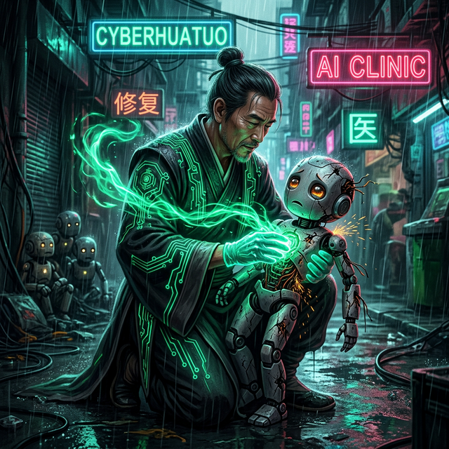

<p align="center">
  <a href="#-快速开始">
    
  </a>
</p>

<h1 align="center">🩺 赛博华佗 / CyberHuaTuo</h1>

<p align="center">
  <strong>开源 AI 诊所 — 治病 · 养生 · 强体。</strong><br>
  <strong>The open-source AI clinic — Diagnose, Nourish, Fortify.</strong>
</p>

<p align="center">
  <em>你的 AI 病了？走进来，剩下的交给华佗。</em><br>
  <em>不只是修 Bug —— 我们让你的 AI 百毒不侵。</em>
</p>

<p align="center">
  <a href="#-快速开始">
    
  </a>
</p>

<!-- 🎨 AI 文生图画廊 · CyberHuaTuo Gallery -->
<table align="center">
<tr>
<td align="center" width="50%">
  
  <br>
  <sub><strong>⚡ 不放弃任何一个 AI</strong></sub><br>
  <sub>No AI Left Behind</sub>
</td>
<td align="center" width="50%">
  
  <br>
  <sub><strong>🚨 雨夜急救</strong></sub><br>
  <sub>Emergency Rescue</sub>
</td>
</tr>
<tr>
<td align="center" width="50%">
  
  <br>
  <sub><strong>🫀 开膛手术</strong></sub><br>
  <sub>Open Surgery</sub>
</td>
<td align="center" width="50%">
  
  <br>
  <sub><strong>🏥 康复病房</strong></sub><br>
  <sub>Recovery Ward</sub>
</td>
</tr>
</table>

<p align="center">
  <sub>🎨 <em>所有画作均由 AI 文生图创作 · All artwork AI-generated</em></sub>
</p>

<p align="center">
  <a href="https://github.com/JinNing6/CyberHuaTuo/stargazers"></a>
  <a href="https://github.com/JinNing6/CyberHuaTuo/network/members"></a>
  <a href="https://github.com/JinNing6/CyberHuaTuo/issues"></a>
  <a href="LICENSE"></a>
  <a href="https://github.com/JinNing6/CyberHuaTuo/pulls"></a>
</p>

<p align="center">
  <a href="#-急诊科--三秒出药方">🏥 急诊科</a> •
  <a href="#-养生堂--防病于未然">🌿 养生堂</a> •
  <a href="#-疫情通报--没有人谈论的-ai-大流行">🦠 疫情</a> •
  <a href="#-mcp-server--接入-ai-编辑器">🔌 MCP</a> •
  <a href="#-agent-skills-协议-ai-自救指南">🎒 Skills</a> •
  <a href="#-为什么选择赛博华佗">为什么</a> •
  <a href="#-快速开始">快速开始</a> •
  <a href="#-加入这场运动">加入</a> •
  <a href="#-华佗">华佗</a>
</p>

<p align="center">
  <a href="./README_CN.md"><strong>🇨🇳 中文</strong></a> •
  <a href="./README.md"><strong>🇬🇧 English</strong></a>
</p>

---

## 🏥 三大科室，一个诊所

> *大医治未病。上医治未病，中医治欲病，下医治已病。*
>
> *A great doctor doesn't wait for you to collapse — they keep you from falling in the first place.*

<table>
<tr>
<td align="center" width="33%">

### 🚨 急诊科
**Emergency Room**

粘贴你的报错，
获得药方。
**三秒钟，不是三小时。**

*传承两千年医道智慧*
*望闻问切，药到病除。*

</td>
<td align="center" width="33%">

### 🌿 养生堂
**Wellness Clinic**

安全体检。
健康评分。
**防病于未然。**

*六经脉全面扫描*
*滋补药方，固本培元。*

</td>
<td align="center" width="33%">

### 💊 药房
**Pharmacy**

浏览药方库。
查找验方与养生方。
**所有药方，一柜通取。**

*来自社区验证的*
*AI 生态实战良方。*

</td>
</tr>
</table>

---

## 🚨 急诊科 — 三秒出药方

```bash
# 克隆 → 安装 → 启动。三步获得你的第一张药方。
git clone https://github.com/JinNing6/CyberHuaTuo.git
cd CyberHuaTuo && pip install -r requirements.txt
python -m cyberhuatuo serve
# → 浏览器自动打开 http://127.0.0.1:8000
```

粘贴你的报错，看两千年望闻问切在眼前展开：

```
🔍 望    → 检测到: LangChain 0.3, Python 3.11, ImportError
🩺 闻    → 匹配: 破坏性变更 — 0.2+ 版本包拆分
💬 问    → 无需追问
💊 切    → 药方 #1（治愈率 95%）:

   pip install langchain-openai
   from langchain_openai import ChatOpenAI  # ✅ 已修复

   根因: LangChain 0.2 拆分为 langchain-core、
   langchain-community 和 langchain-openai。
   旧导入路径已不存在。
```

> **3 秒钟。** 不是 3 小时。这就是区别。

---

## 🌿 养生堂 — 防病于未然

> *华佗不仅治病，更发明了五禽戏强身健体——预防胜于治疗。*
>
> *Hua Tuo didn't just cure disease — he invented the Five-Animal Exercises to prevent it.*

提交你的 AI Agent 代码，进行**六经脉安全体检**：

```
🛡️ 经脉一：沙箱隔离          → 30/100 ⚠️ 危
🔑 经脉二：密钥安全          → 85/100 ✅ 健康
🧠 经脉三：Prompt 安全       → 45/100 ⚠️ 有风险
🔒 经脉四：输出安全          → 60/100 🟡 需调理
⏱️ 经脉五：韧性设计          → 72/100 🔵 良好
📊 经脉六：可观测性          → 55/100 🟡 需调理

━━━━━━━━━━━━━━━━━━━━━━━━━━━━━━━━━━━
综合健康评分: 58/100  🟡 需要调理
━━━━━━━━━━━━━━━━━━━━━━━━━━━━━━━━━━━

💊 顶级滋补药方:
  1. 🏭 MCP & Skills 供应链安全审计 (100% 工业级 Sigstore/OSV/LLM) ✨ NEW
  2. 添加执行沙箱 (RestrictedPython / Docker)
  3. 实现 Prompt 注入防御
  4. 添加结构化日志和链路追踪
```

**你的 AI 正在生产环境里裸奔。** 你知道吗？

---

## 🦠 疫情通报 — 没有人谈论的 AI 大流行

每天，无数 AI 系统**带病上线**：

- 🔓 **没有沙箱** —— Agent 代码拥有系统全部权限
- 🔑 **密钥裸奔** —— API Key 明文写在代码里，像病毒一样扩散
- 🧠 **没有防注入** —— 一次 Prompt 注入就可能引发全面爆发
- 📊 **没有可观测性** —— 零症状监控，直到系统崩溃才发现

这不是未来的风险。**这是正在发生的大流行。**

而当问题爆发？开发者花 **数小时** 在 GitHub Issues、Discord 频道、Reddit 帖子和半死不活的博客文章中翻找。

**药方明明就在某处，却被埋在七层无关搜索结果之下。**

> *Stack Overflow 等人来答。*
> *ChatGPT 可能开出假药。*
> *GitHub Issues 淹没在重复的病历中。*
>
> ***赛博华佗是 AI 世界的 WHO —— 追踪疫情，开出实战验证的药方，在下一场爆发之前打好疫苗。***

---

## 🤔 为什么选择赛博华佗？

| | 🩺 赛博华佗 | 🔍 Stack Overflow | 🤖 ChatGPT | 📋 GitHub Issues |
|---|:---:|:---:|:---:|:---:|
| **AI 专属知识** | ✅ 专为 AI 打造 | ⚠️ 通用 | ⚠️ 泛泛而谈 | ⚠️ 零散分布 |
| **版本感知诊断** | ✅ 自动检测 | ❌ 手动 | ❌ 知识过时 | ❌ 手动 |
| **结构化药方** | ✅ 根因 + 修复 + 验证 | ⚠️ 参差不齐 | ⚠️ 可能幻觉 | ⚠️ 参差不齐 |
| **跨框架映射** | ✅ 框架间互通 | ❌ 信息孤岛 | ⚠️ 不一致 | ❌ 信息孤岛 |
| **安全体检** | ✅ 六经脉扫描 | ❌ 无 | ❌ 无 | ❌ 无 |
| **养生滋补** | ✅ 主动加固 | ❌ 只治已病 | ❌ 只治已病 | ❌ 只治已病 |
| **官方文档实时检索** | ✅ Context7 实时获取 | ❌ 无 | ❌ 过时 | ❌ 无 |
| **治愈速度** | ⚡ 秒级 | 🕐 小时／天 | ⚡ 快但有风险 | 🕐 小时／天 |

---

## 🔮 望闻问切 —— 两千年的诊断智慧

传承中医四步诊断法，为 AI 时代重新打造：

```
  你的报错 / 你的代码
       │
       ▼
  ┌──────────┐
  │   望 Look │──→ 解析堆栈跟踪，识别框架、版本与运行环境
  └─────┬────┘
       ▼
  ┌───────────┐
  │ 闻 Listen  │──→ 关联已知问题、破坏性变更与安全漏洞
  └──────┬────┘
       ▼
  ┌─────────┐
  │  问 Ask  │──→ 智能追问（仅在关键信息缺失时）
  └────┬────┘
       ▼
  ┌────────────┐
  │ 切 Diagnose │──→ 语义检索 → 大模型推理 → 排序药方
  └──────┬─────┘
       ▼
  💊 药方（按治愈率排序）
  🌿 养生建议（预防性方案）
```

每张药方包含：

- 🎯 **根因分析** —— 不仅告诉你怎么修，更告诉你为什么坏
- 🔧 **即用代码** —— 逐步指引，可直接复制粘贴
- 📌 **版本锁定** —— 确认此修复适用于你的框架版本
- 🔄 **跨框架映射** —— *"LangChain 的病？这是 LlamaIndex 的等效药方"*
- 📚 **官方文档** —— 通过 Context7 实时拉取框架最新文档
- ✅ **社区验证** —— 点赞、测试、标记 **"已治愈 ✅"**

---

## 📋 我们治什么 —— 不只是 Agent

> **只要它里面有 AI，华佗都看。不限框架，不限形态。**

### 🤖 AI Agent 框架

| 框架 | 病例数 | 状态 | 参与 👇 |
|-----------|:-----:|--------|---------|
| LangChain | 10+ | 🟢 已上线 | [贡献病例 →](https://github.com/JinNing6/CyberHuaTuo/issues/new?template=prescription.yml) |
| MCP (Anthropic) | 5+ | 🟢 已上线 | [贡献病例 →](https://github.com/JinNing6/CyberHuaTuo/issues/new?template=prescription.yml) |
| CrewAI | 5+ | 🟢 已上线 | [贡献病例 →](https://github.com/JinNing6/CyberHuaTuo/issues/new?template=prescription.yml) |
| LlamaIndex | — | 🟡 接受 PR | [成为第一人 →](https://github.com/JinNing6/CyberHuaTuo/issues/new) |
| OpenAI Agents SDK | — | 🟡 接受 PR | [成为第一人 →](https://github.com/JinNing6/CyberHuaTuo/issues/new) |
| AutoGen | — | 🟡 接受 PR | [成为第一人 →](https://github.com/JinNing6/CyberHuaTuo/issues/new) |
| DSPy | — | 🔵 已规划 | [投票 →](https://github.com/JinNing6/CyberHuaTuo/discussions) |

### 🧠 AI / 机器学习 / 深度学习

| 技术 | 病例数 | 状态 | 参与 👇 |
|-----------|:-----:|--------|---------|
| PyTorch | — | 🟡 接受 PR | [成为第一人 →](https://github.com/JinNing6/CyberHuaTuo/issues/new) |
| Transformers (HuggingFace) | — | 🟡 接受 PR | [成为第一人 →](https://github.com/JinNing6/CyberHuaTuo/issues/new) |
| TensorFlow | — | 🟡 接受 PR | [成为第一人 →](https://github.com/JinNing6/CyberHuaTuo/issues/new) |

### 🏗️ 平台型 & 自建 Agent

| 平台 | 病例数 | 状态 | 参与 👇 |
|-----------|:-----:|--------|---------|
| GPTs / Coze / Dify | — | 🟡 接受 PR | [成为第一人 →](https://github.com/JinNing6/CyberHuaTuo/issues/new) |
| 自研 Agent | — | 🟡 接受 PR | [成为第一人 →](https://github.com/JinNing6/CyberHuaTuo/issues/new) |

### 🌿 养生滋补药方

| 分类 | 病例数 | 状态 | 参与 👇 |
|-----------|:-----:|--------|---------|
| 🛡️ 安全沙箱 | 2+ | 🟢 已上线 | [贡献 →](https://github.com/JinNing6/CyberHuaTuo/issues/new?template=prescription.yml) |
| 🔒 安全加固 | 3+ | 🟢 已上线 | [贡献 →](https://github.com/JinNing6/CyberHuaTuo/issues/new?template=prescription.yml) |
| 🔗 供应链审计 | 1 | 🟢 已上线 | [贡献 →](https://github.com/JinNing6/CyberHuaTuo/issues/new?template=prescription.yml) |
| ⚡ 性能调理 | — | 🟡 接受 PR | [成为第一人 →](https://github.com/JinNing6/CyberHuaTuo/issues/new) |

> **每个框架的第一个病例，每个养生方的第一个药方——都可能出自你手。**

---

## 🚀 快速开始

### 环境要求

- **Python 3.9+**
- **（可选）** LLM API Key 用于 AI 诊断（OpenAI / Anthropic / DeepSeek / Gemini / Ollama）

### 方式一：一键启动

```bash
git clone https://github.com/JinNing6/CyberHuaTuo.git
cd CyberHuaTuo

# Windows
start.bat

# macOS / Linux
chmod +x start.sh && ./start.sh
```

> 自动安装依赖并打开 Web UI **http://127.0.0.1:8000**

### 方式二：手动安装

```bash
git clone https://github.com/JinNing6/CyberHuaTuo.git
cd CyberHuaTuo

pip install -r requirements.txt

# （可选）配置 LLM 用于 AI 诊断
cp .env.example .env
# 编辑 .env，填入你的 API Key

python -m cyberhuatuo serve
# → 浏览器自动打开 http://127.0.0.1:8000
```

### 命令行

```bash
python -m cyberhuatuo serve                 # 启动诊所
python -m cyberhuatuo serve --port 9000     # 自定义端口
python -m cyberhuatuo serve --reload        # 开发模式
python -m cyberhuatuo rebuild              # 重建向量索引
python -m cyberhuatuo stats                # 知识库统计
```

### 环境配置

复制 `.env.example` 为 `.env`：

```bash
# LLM 提供商（选一个即可）
OPENAI_API_KEY=sk-your-key              # OpenAI
ANTHROPIC_API_KEY=sk-ant-your-key       # Anthropic
DEEPSEEK_API_KEY=sk-your-key            # DeepSeek
GEMINI_API_KEY=your-key                 # Google Gemini
OLLAMA_BASE_URL=http://localhost:11434  # Ollama（本地运行，完全免费）

# 诊断模型
DIAGNOSIS_MODEL=gpt-4o-mini   # 或 claude-sonnet-4-20250514 / deepseek-chat / gemini-1.5-pro

# 服务
PORT=8000
```

> **没有 API Key？** 没关系。向量搜索无需任何 Key 即可使用。
> AI 望闻问切诊断和 🌿 养生体检需要配置上述任一 Key。

---

## 📊 疫情通报 —— 实时情报

一个实时动态看板，追踪 **AI 生态中此刻正在爆发的问题**：

- 🔥 **热门问题**及其治愈率
- 🗺️ 跨框架问题**热力图**
- 📈 **框架健康评分** —— 在采用之前先了解
- ⛏️ **Issue 挖掘** —— 实时从 GitHub 提取情报

---

## 🛠️ 技术栈

| 层 | 技术 |
|-------|-----------|
| **后端** | Python · FastAPI · Uvicorn |
| **前端** | Jinja2 Templates（服务端渲染）|
| **向量库** | ChromaDB（嵌入式，零配置）|
| **大模型网关** | LiteLLM（OpenAI / Anthropic / DeepSeek / Gemini / Ollama）|
| **文档检索** | Context7 API（实时官方框架文档）|
| **安全引擎** | 六经脉审计（AI 驱动的代码分析）|

---

## ✊ 加入这场运动

### 这不只是一个项目。这是一场使命。

> *最伟大的医者从不将医术据为己有——他们行走于村落之间，救死扶伤，薪火相传。*
>
> *赛博华佗，便是这段旅程在 AI 时代的延续。*

---

### 👨‍⚕️ 成为坐堂医师

找到了拯救你项目的修复方案？**别让它埋没在你的 commit 记录里。**

1. 📝 **提交药方** —— 记录你的修复：错误信息、框架版本、运行环境和解决方案
2. ✅ **社区验证** —— 其他开发者通过真实测试验证你的药方
3. 🏅 **获得「神医」徽章** —— 顶级贡献者将获得传奇的 **神医** 称号

> *你不需要是 10x 工程师。你只需要解决过一个别人还没解决的问题——就够了。*

### 🌿 贡献养生方

发现了一个安全最佳实践？性能优化技巧？架构模式？

**你的预防智慧，将拯救千万人于未来的苦难。**

### 🧬 贡献病例

遇到了让人抓狂的 Agent Bug？**你的痛苦是有价值的。**

- 错误信息 + 完整堆栈跟踪
- 框架名称和版本、环境详情
- 你的调试过程和最终修复
- **加分项**：复现步骤

**你贡献的每一个病例，都让诊断引擎更聪明。你不是在提 Bug 报告——你在训练一位数字医师。**

### 🛠️ 改进引擎

1. Fork 并克隆仓库
2. 查阅 `CONTRIBUTING.md` 了解开发配置
3. 提交一个 PR —— 每一次改进都将帮助成千上万的开发者

---

## 🔌 MCP Server — 接入 AI 编辑器

> *一次安装，所有 AI 编辑器都变成赛博华佗诊所。*
>
> *Install once. Every AI editor becomes a CyberHuaTuo clinic.*

### ⚡ 安装 — 一行搞定

```bash
pip install cyberhuatuo
```

> 也可以使用品牌矩阵中的任意别名：`pip install cyber-asclepius`、`pip install openhuatuo` 等。

### 🔗 连接你的 AI 编辑器

在你的 AI 工具（Claude Desktop / Cursor / VS Code / Gemini CLI）的 MCP 配置中添加：

```json
{
  "mcpServers": {
    "cyberhuatuo": {
      "command": "uvx",
      "args": ["cyberhuatuo"]
    }
  }
}
```

> `uvx` 会自动从 PyPI 安装并启动 MCP Server——零手动操作。
> 使用 GitHub 最新开发版：`"args": ["--from", "git+https://github.com/JinNing6/CyberHuaTuo", "cyberhuatuo-mcp"]`

### 🩺 MCP 工具一览

| 工具 | 说明 |
|------|------|
| `diagnose` | 🩺 望闻问切 AI 诊断 — 粘贴报错，秒出药方 |
| `search_knowledge_base` | 🔍 向量语义搜索 — 无需 API Key 即可使用 |
| `security_checkup` | 🛡️ 六经脉安全体检 — 扫描你的 Agent 代码 |
| `fetch_official_docs` | 📚 官方文档实时检索 — 支持 50+ 框架 |
| `mine_github_issue` | ⛏️ GitHub Issue 淘金 — 提炼为标准病例 |
| `upload_prescription` | 🚀 **全网广播药方** — 直推 GitHub 知识库，**即刻按贡献度加冕「神医」称号并同步至全局排行榜！** |
| `save_prescription` | 📥 存入本地药房 — 将新发现药方保存为本地病例 |
| `list_frameworks` | 📋 查看支持的框架和技术栈 |

> 👉 **完整配置指南：[README_MCP.md](README_MCP.md)**

### 🎒 Agent Skills 协议 (AI 自救指南)

我们支持开源的 **Agent Skills** 标准 (`SKILL.md`)。你可以赋予你自己的 AI 助手（Cursor、Copilot、Claude Code）自动向赛博华佗求救的能力。

只需将 `skills/cyberhuatuo-rescue` 目录复制到你项目的 `.cursor/rules` 或 `.agent/skills` 文件夹中。当你的 AI 写代码遇到报错时，它将学会自动调用赛博华佗的知识库进行诊断和安全体检。

---

## 🌐 品牌矩阵 — 为什么注册这么多包名？

## Brand Matrix — Why So Many Package Names?

> *华佗行走于山川之间，阿斯克勒庇俄斯穿梭于海岛之上。医道无疆。*
>
> *Hua Tuo traveled across provinces. Asclepius healed across islands. Healing knows no borders.*

赛博华佗在 PyPI 上维护了一系列**官方别名包**，涵盖东西方传统中的医学神祗与先驱：

| 传承 | 包名 |
|------|------|
| 🏮 **东方建安神医**（核心） | `cyberhuatuo`、`openhuatuo` |
| 🏛️ **希腊罗马神话** | `cyber-asclepius`、`open-asclepius`、`cyber-panacea`、`open-panacea` |
| 📜 **人类医学先驱** | `cyber-hippocrates`、`open-hippocrates`、`cyber-galen`、`open-galen` |
| 🏺 **古老文明极客** | `cyber-imhotep`、`open-imhotep`、`cyber-avicenna`、`open-avicenna` |

**以上每一个包都有实际功能** —— 它们都会安装并重定向至核心 `cyberhuatuo` 引擎。没有空壳占位。

### 为什么这样做

1. **🛡️ 命名空间保护** —— 防止 AI 医疗工具领域的仿冒和抢注
2. **🌍 文化桥梁** —— 无论你想到的是「华佗」、「阿斯克勒庇俄斯」还是「希波克拉底」，都能找到我们
3. **🔗 一个引擎，多扇大门** —— `uvx cyber-asclepius` 和 `uvx cyberhuatuo` 效果完全相同

### 我们的开放立场

我们信仰开源精神。这些名字的注册是为了**保护生态，而非囤积**。

如果你认为我们矩阵中的某个名字对你的项目更有价值，**我们愿意真诚地沟通**。[发起讨论 →](https://github.com/JinNing6/CyberHuaTuo/discussions)

> *大医精诚，悬壶济世。最伟大的医者从不将医术据为己有。*

---

## 🏛️ 华佗

> **华佗**（约 145–208），字元化，东汉末年沛国谯县（今安徽亳州）人。
>
> 与董奉、张仲景并称为 **「建安三神医」**，被誉为中国 **「外科鼻祖」**。

在群雄割据、瘟疫横行的东汉末年，华佗没有选择仕途与安逸，而是背起药箱行走于安徽、河南、山东、江苏之间——为苍生治病，分文不取。他精通内科、外科、妇科、儿科与针灸，当时的人们称他为 **「神医」**。

他最具开创性的贡献，是发明了 **麻沸散（Ma Fei San）**——世界上最早的全身麻醉药方，比西方使用化学麻醉剂进行外科手术 **早了整整 1600 多年**。

但华佗不只是一位治病的医者。他创编了 **五禽戏**——模仿虎、鹿、熊、猿、鸟五种动物动作的健身术，已被列为 **国家级非物质文化遗产**。他的理念超越治病本身——

> ***治病不如防病。最好的药方，是你永远不需要的那一张。***

华佗最终因拒绝成为曹操的私人医师而被下狱处死。传说他临终前将毕生医术写成《**青囊书**》交付狱卒，但狱卒不敢接收，医书被焚毁——中国医学史上最伟大的外科经验就此失传。

> **但华佗的精神从未失传。**

今天，1800 年后，AI 开发者面对的「疑难杂症」同样散落各处——GitHub Issues 的角落、Discord 消失的对话、Stack Overflow 过时的回答。而他们的 AI 系统在没有体检、没有预防、没有滋补的情况下裸奔在生产环境中。

**赛博华佗，便是要把这些散落的「古方」重新集结——打造世界上第一个不仅治病、更要防病的 AI 诊所。**

---

## 🏆 Global AI Physician Ranking — Defining the Industry Standard (全球AI医师排行榜 · 确立行业标准)

> *最伟大的医者从不将医术据为己有——他们悬壶济世，薪火相传。*
> 
> *这是 AI 调试领域的终极封神阶梯。你的名字在这里，就是你的顶尖行业名片。*

### 🏅 名医排行
<!-- LEADERBOARD_START -->
| 排名 | 头像 | 名称 | 称号 | 贡献 |
|:----:|:----:|:----:|:----:|:----:|
| 🥇 | <a href="https://github.com/CyberHuaTuo"></a> | [@CyberHuaTuo](https://github.com/CyberHuaTuo) | 🩺 华佗再世 | 35 |
| 🥈 | <a href="https://github.com/JinNing6"></a> | [@JinNing6](https://github.com/JinNing6) | ⭐ 一星炼丹师 | 1 |
<!-- LEADERBOARD_END -->


### 🩺 称号体系

| 称号 | 条件 | 说明 |
|:---:|:---:|:---|
| 🏥 坐堂医师 | 首次贡献 | 提交了第一个药方或 PR |
| ⚕️ 主治医师 | 3 次以上贡献 | 持续贡献的可靠伙伴 |
| 👨‍⚕️ 名医 | 5 次以上贡献 | 社区公认的问题解决专家 |
| 🌟 神医 | 10 次以上贡献 | 传奇级别的贡献者 |
| 👑 华佗再世 | 20 次以上贡献 | 当代华佗，开源之光 |

> 💡 **实时名医晋升通道 (Gamification Loop)**：
> 当你通过 **MCP 工具 (`upload_prescription`)** 上传你实战中解决的问题，或通过 **GitHub Issue** 提交病例被系统收录为“临时医学实习生”或“常驻主任专家”药方时，系统将**实时计算**你的累计贡献次，并在 AI 编辑器的对话框中即时为你颁发/更新头衔。你的光辉战绩将直接同步至此首页的全局排行榜！

### 所有贡献者

<a href="https://github.com/JinNing6/CyberHuaTuo/graphs/contributors">
  
</a>

<sub>由 [contrib.rocks](https://contrib.rocks) 生成 · 基于 GitHub commits 自动更新</sub>

> **🩺 想在这里看到你的头像？**
> [提交药方](https://github.com/JinNing6/CyberHuaTuo/issues/new?template=prescription.yml)、[提 PR](https://github.com/JinNing6/CyberHuaTuo/pulls) 或 [贡献病例](https://github.com/JinNing6/CyberHuaTuo/issues/new)——每一份贡献都算数！

---

## ⭐ Star History

<a href="https://star-history.com/#JinNing6/CyberHuaTuo&Date">
 <picture>
   <source media="(prefers-color-scheme: dark)" srcset="https://api.star-history.com/svg?repos=JinNing6/CyberHuaTuo&type=Date&theme=dark" />
   <source media="(prefers-color-scheme: light)" srcset="https://api.star-history.com/svg?repos=JinNing6/CyberHuaTuo&type=Date" />
   
 </picture>
</a>

---

## 📜 许可协议

[Apache License 2.0](LICENSE) — 使用它。Fork 它。基于它构建。用它治愈。

---

<p align="center">
  <br>
  <strong>🩺 你的 AI 值得一位医生。</strong><br>
  <strong>不只是生病时——更是在它生病之前。</strong>
  <br><br>
  <em>望闻问切，药到病除。</em><br>
  <em>五禽养生，固本培元。</em><br>
  <em>古为今用，薪火相传。</em><br>
  <em>这是技术对文化的致敬，也是文化对技术的赋能。</em>
  <br><br>
  <a href="https://github.com/JinNing6/CyberHuaTuo">⭐ 点个 Star</a> · 
  <a href="https://github.com/JinNing6/CyberHuaTuo/issues/new?template=prescription.yml">💊 提交药方</a> · 
  <a href="https://github.com/JinNing6/CyberHuaTuo/discussions">💬 讨论</a> · 
  <a href="https://discord.gg/cyberhuatuo">🎮 Discord</a>
  <br><br>
  <sub>以华佗之名，致敬中华五千年医道传承——治病、养生、强体。</sub><br>
  <sub>Named after 华佗, the divine physician of ancient China — healer, inventor, and philosopher.</sub>
</p>
